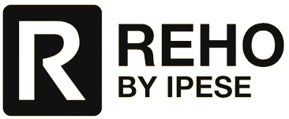

Overview
++++++++
.. _label_sec_overview:

:Version: |version| |release|
:Last update: |today|
:Authors: Dorsan Lepour, Joseph Loustau, Cédric Terrier
:Short summary: Renewable Energy Hub Optimizer (REHO) - A Decision Support Tool for Renewable Energy Communities

The transition to sustainable energy systems in the face of growing renewable energy adoption and electrification is
a complex and critical challenge. Renewable Energy Hub Optimizer (REHO) emerges as a powerful decision support
tool designed to investigate the deployment of energy conversion and storage technologies in this evolving landscape.
This documentation introduces REHO and highlights its key features and contributions to the field of
sustainable energy system planning.

Model foundations
=================

**MILP Framework:** REHO leverages a Mixed-Integer Linear Programming (MILP) framework to simultaneously address the
optimal design and operation timing of capacities. This approach ensures a comprehensive analysis, capturing the dynamic
interplay of technology deployment and energy demand.

**Multi-Objective Optimization:** REHO's versatility extends to multi-objective optimization, accommodating
objectives related to economic (capital and operational costs), environmental (life cycle analysis and global warming
potential), and efficiency criteria. Epsilon constraints provide fine-grained control, enabling decision-makers to
explore trade-offs and identify Pareto fronts.

**Multi-Scale Capabilities:** REHO's flexibility spans various scales, from individual buildings to entire districts.
The district-scale optimization feature capitalizes on synergies between buildings, allowing them to function as an
energy community and enabling energy and financial flows between buildings. In addition, the district-scale approach
opens up the possibility of deploying larger capacities, such as centralized equipment and heat distribution
infrastructures.

**Multi-Service Consideration:** REHO encompasses a wide range of end-use demands, including thermal comfort (heating
and cooling needs), domestic hot water, domestic electricity, mobility, and even information and communication
technologies (ICT) end-use demand.

**Multi-Energy Integration:** REHO incorporates various energy sources and networks, such as electricity, fossil
fuels, biomass, biofuels, hydrogen, and district heating and cooling networks.
This holistic approach ensures a comprehensive representation of the energy landscape.

**Open-Source and Interoperability:** REHO is fully open-source, supported by comprehensive documentation. It
utilizes AMPL for the core optimization model, encompassing objective functions, modeling equations, and constraints
(e.g., energy and mass balances, heating cascade). Python is employed for efficient data management, boasting the
capability to interface and exchange information with other tools.

Features
========

Building stock database
----------------------------

Each building to be optimized needs to be characterized to estimate its energy demand, its renewable potential, and its sector coupling potential.
REHO embeds a coupling with `QBuildings <https://ipese-web.epfl.ch/lepour/qbuildings/>`_,
a GIS database characterizing the entire Swiss building stock from an energy point of view (end-use demand, buildings morphology, endogenous resources).
This database is built by gathering different public databases and combining with norms and standard energy requirements
as defined by the Société suisse des *Ingénieurs et des Architectes* (SIA).
REHO therefore contains default values for characterizing the building stock and generating the end-use demand profiles.
Statistical parameters can be overwritten with available measurements.

For the optimization of buildings that are not part of the QBuildings database, REHO can also simply read out the relevant information from CSV files.

Typical days
----------------------------

The task of optimally designing and scheduling energy systems with a high share of renewable energies is complex and computationally demanding.
REHO includes machine learning techniques to cluster yearly input data to typical periods.
The model operates in the conventional way with typical periods of 24 hours, but can be freely adapted to a finer or coarser granularity as required.

Thermal envelope
----------------------------

Thermal envelope insulation is a cornerstone of building retrofitting as it directly reduces conductive heat losses through walls, roofs, and floors,
thereby lowering total space heating demand and improving overall energy performance.
Upgrading insulation to standards is a crucial step for enabling effective integration of renewable heat sources.
REHO integrates a dynamic approach to assess the best-suited decision among a list of renovation options, encompassing
all other constraints of the multi-objective optimization model.

Buildings coordination
----------------------------

An energy community allows buildings to exchange energy flows with each other and share mutualized equipment.
They improve the self-consumption of local resources by coupling distributed energy sources, and enhance the energy efficiency by supplying multiple services to the consumers.
They foster a high penetration of renewable energy in urban systems, while mitigating the need for equipment and infrastructure
reinforcements. As energy communities are central to the energy transition, it is crucial to assess their technical advantages,
and to quantify their financial and environmental benefits.

REHO allows to conduct the optimization of a specified territory at the building-scale or the district-scale.
A building-scale optimization treats all the considered buildings independently (i.e. each of them is optimized
regardless of the presence of the others). In contrast, a district-scale optimization considers the whole building stock
as being able to interact, and exploits the synergies of the overall system defined by the buildings to be optimized.
Buildings are optimized inter-dependently, by applying the Dantzig-Wolfe decomposition algorithm to break down the
problem into a master problem and subproblems. The master problem adopts the transformer perspective,
while a subproblem is defined for each building connected to this transformer.

PV integration
----------------------------

Given the pivotal role of photovoltaic (PV) systems in the energy transition, their optimal deployment is of paramount
importance and must take into account the specific characteristics of the building morphology, the local solar irradiance,
and the existing electrical grid.
REHO integrates the deployment of solar panels on roofs and facades, with the possibility to take into consideration the
orientation of surfaces (i.e., tilt and azimuth of PV panels as decision variables).

ICT integration
----------------------------

Facing the growing demand for data processing, data storage and data transmission, an essential aspect of energy integration relates
to datacenters. REHO allows to investigate the economic and environmental rationales of decentralized computing capacities integrated into the building stock.
These units can be installed at building or district-level, and their residual heat can be valorized using either air or liquid cooling models.
Operation and effectiveness of the datacenters can be parameterized, as well as their utilization rate or the demand profile they have to satisfy for data processing.

Electric mobility
----------------------------

The electrification of mobility is at the heart of the energy transition in urban environments.
REHO enables the integration of electric vehicles into neighborhoods, including the possibility of intelligent
unidirectional or bidirectional charging. The fleet of electric vehicles can thus be used to provide an energy storage service.

Grid reinforcement
----------------------------

As the electrification of heating and mobility sectors gains momentum, the demands placed on the electricity grid are
expected to further escalate. The existing electrical grid, originally designed for centralized power generation and
unidirectional energy flow, now faces new demands and complexities.
These challenges encompass managing the variability in electricity supply resulting from renewable energy integration
and addressing the increasing electrification of diverse sectors.
REHO allows for the consideration of the local low-voltage grid characteristics, through hard (maximum line and transformer capacity)
or soft constraints (power peaks mitigation, grid usage penalty).
Grid reinforcement allows to consider the extension of the grid capacity as a decision variable.

District heating and cooling
----------------------------

District heating and cooling (DHC) systems have a large potential to support the decarbonization of the heating and cooling needs.
REHO enables the deployment of DHC, with consideration of several heat transfer fluids and distribution temperatures.
Infrastructure costs are also incorporated, based on the topology of the considered neighbourhood.

Actor-based model
----------------------------

The *ActorsProblem* extension of REHO enables to integrate and model the different stakeholders of an energy community.
A two-step MILP optimization method is proposed: as a first step, a list of technical configurations for the building stock refurbishment are generated;
as a second step, the best-suited configuration is selected according to economical criteria considering the stakeholders involved in the energy community,
with a parameterization of their portfolios through minimum and maximum boundaries.

An example is provided with the modelization of tenants, landlords, distribution system operator, authorities,
and a new governing entity managing energy at district-level: the energy community manager.
This latter is here suggested as a profit-making structure whose role is to manage the initial investments allocated to the district-level equipment,
and also to coordinate the daily operation of the local energy system through an actor-based energy pricing.
But alternative business models with other stakeholders and associated interactions can be freely defined and modeled.