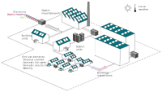
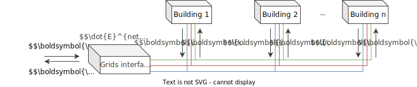

.. _sec_model:

Model
+++++

The energy hub concept is used to model an energy community where multi-energy carriers can supply
diverse end use demands through building-level equipment and district-level infrastructure optimally interconnected and operated.
For a delimited perimeter of buildings, REHO selects the optimal energy system configuration minimizing the specified objective function.
All the energy flows at building-level and district-level are then fully characterized by the model decision variables.

   District-level energy hub model in REHO

Energy demands considered by the model are: thermal comfort (space heating and cooling), domestic hot water (DHW), domestic electricity, and mobility needs.
Domestic electricity, DHW, and mobility needs are generated using standardized profiles according to norms or measurements in a pre-processing step.
In contrast, the thermal comfort demand is modeled within the framework itself in order to include the control strategy of the energy management system and the possibility of a thermal renovation of the building.
This heating or cooling demand is impacted by factors such as the conductive heat losses through the building envelope, the heat capacity of the building and the heat gains from occupants, electric appliances and solar irradiation.
Furthermore, the energy demand associated with thermal comfort is characterized by the desired comfort temperature of the rooms, the nominal return and supply temperature of the heat distribution system and the control strategy of latter.

Heating and cooling requirements can be satisfied by energy conversion technologies (such as a heat pump, an electrical heater, a fuel cell, a gas boiler, an air conditioner...) or directly from a district heating infrastructure.
Energy can be stored in installed equipment (such as a battery or a water tank), or in the form of building thermal inertia.
Photovoltaic panels act as a renewable energy source.
The building-level energy system is interconnected to the energy distribution infrastructure of the district (electrical grid, natural gas grid, ...).

.. figure:: ../images/model.svg
   :align: center
   :name: fig-model

   REHO model architecture

.. figure:: ../images/building.png
   :width: 450
   :align: center
   :name: building

   Building-level energy hub in REHO

List of symbols
===========================

.. note::
    In the following, all decision variables of the model are denoted with **bold letters** to distinguish them from the parameters.

.. tab-set::

    .. tab-item:: Variables

        +------------------------------+-------------------------------------------------+-------------------------+
        | :math:`\boldsymbol{C}`       | cost                                            | :math:`\text{currency}` |
        +------------------------------+-------------------------------------------------+-------------------------+
        | :math:`\boldsymbol{E}`       | electricity                                     | :math:`kW(h)`           |
        +------------------------------+-------------------------------------------------+-------------------------+
        | :math:`\boldsymbol{G}`       | global warming potential                        | :math:`kg_{CO_2, eq}`   |
        +------------------------------+-------------------------------------------------+-------------------------+
        | :math:`\boldsymbol{H}`       | natural gas or fresh water                      | :math:`kW(h)`           |
        +------------------------------+-------------------------------------------------+-------------------------+
        | :math:`\boldsymbol{Q}`       | thermal energy                                  | :math:`kWh`             |
        +------------------------------+-------------------------------------------------+-------------------------+
        | :math:`\boldsymbol{R}`       | residual heat                                   | :math:`kWh`             |
        +------------------------------+-------------------------------------------------+-------------------------+
        | :math:`\boldsymbol{T}`       | temperature                                     | :math:`K`               |
        +------------------------------+-------------------------------------------------+-------------------------+
        | :math:`\boldsymbol{f}`       | sizing variable                                 | :math:`\diamondsuit`    |
        +------------------------------+-------------------------------------------------+-------------------------+
        | :math:`\boldsymbol{\lambda}` | decomposition decision variable, master problem | :math:`-`               |
        +------------------------------+-------------------------------------------------+-------------------------+
        | :math:`\boldsymbol{y}`       | decision variable, binary                       | :math:`-`               |
        +------------------------------+-------------------------------------------------+-------------------------+

    .. tab-item:: Parameters

            +-------------------+------------------------------------------+--------------------------------------+
            | :math:`A`         | area                                     | :math:`m^2`                          |
            +-------------------+------------------------------------------+--------------------------------------+
            | :math:`C`         | heat capacity coefficient                | :math:`kW/m^2K`                      |
            +-------------------+------------------------------------------+--------------------------------------+
            | :math:`F`         | bound of validity range of unit sizes    | :math:`\diamondsuit`                 |
            +-------------------+------------------------------------------+--------------------------------------+
            | :math:`\Phi`      | specific heat gain                       | :math:`kW/m^2`                       |
            +-------------------+------------------------------------------+--------------------------------------+
            | :math:`Q`         | thermal power                            | :math:`kW`                           |
            +-------------------+------------------------------------------+--------------------------------------+
            | :math:`T`         | temperature                              | :math:`K`                            |
            +-------------------+------------------------------------------+--------------------------------------+
            | :math:`U`         | heat transfer coefficient                | :math:`kW/m^2K`                      |
            +-------------------+------------------------------------------+--------------------------------------+
            | :math:`V`         | volume                                   | :math:`m^3`                          |
            +-------------------+------------------------------------------+--------------------------------------+
            | :math:`\alpha`    | azimuth angle                            | :math:`^{\circ}`                     |
            +-------------------+------------------------------------------+--------------------------------------+
            | :math:`\beta`     | limiting angle                           | :math:`^{\circ}`                     |
            +-------------------+------------------------------------------+--------------------------------------+
            | :math:`c`         | energy tariff                            | :math:`\text{currency}/kWh`          |
            +-------------------+------------------------------------------+--------------------------------------+
            | :math:`c_p`       | specific heat capacity                   | :math:`kJ/(kgK)`                     |
            +-------------------+------------------------------------------+--------------------------------------+
            | :math:`d`         | distance                                 | :math:`m`                            |
            +-------------------+------------------------------------------+--------------------------------------+
            | :math:`d_p`       | frequency of periods per year            | :math:`d/yr`                         |
            +-------------------+------------------------------------------+--------------------------------------+
            | :math:`d_t`       | frequency of timesteps per period        | :math:`h/d`                          |
            +-------------------+------------------------------------------+--------------------------------------+
            | :math:`e`         | electric power                           | :math:`kW/m^2`                       |
            +-------------------+------------------------------------------+--------------------------------------+
            | :math:`\epsilon`  | elevation angle                          | :math:`^{\circ}`                     |
            +-------------------+------------------------------------------+--------------------------------------+
            | :math:`f_{b,r}`   | spatial fraction of a room in a building | :math:`-`                            |
            +-------------------+------------------------------------------+--------------------------------------+
            | :math:`f^s`       | solar factor                             | :math:`-`                            |
            +-------------------+------------------------------------------+--------------------------------------+
            | :math:`fû`        | usage factor                             | :math:`-`                            |
            +-------------------+------------------------------------------+--------------------------------------+
            | :math:`g`         | global warming potential streams         | :math:`kg_{CO_2, eq}/kWh`            |
            +-------------------+------------------------------------------+--------------------------------------+
            | :math:`\gamma`    | tilt angle                               | :math:`^{\circ}`                     |
            +-------------------+------------------------------------------+--------------------------------------+
            | :math:`g^{glass}` | ratio of glass per facades               | :math:`-`                            |
            +-------------------+------------------------------------------+--------------------------------------+
            | :math:`h`         | height                                   | :math:`m`                            |
            +-------------------+------------------------------------------+--------------------------------------+
            | :math:`i`         | interest rate                            | :math:`-`                            |
            +-------------------+------------------------------------------+--------------------------------------+
            | :math:`i^{cl}`    | fixed investment cost                    | :math:`\text{currency}`              |
            +-------------------+------------------------------------------+--------------------------------------+
            | :math:`i^{c2}`    | continuous investment cost               | :math:`\text{currency}/\diamondsuit` |
            +-------------------+------------------------------------------+--------------------------------------+
            | :math:`i^{g1}`    | fixed impact factor                      | :math:`kg_{CO_2, eq}`                |
            +-------------------+------------------------------------------+--------------------------------------+
            | :math:`i^{g2}`    | continuous impact factor                 | :math:`kg_{CO_2, eq}/ \diamondsuit`  |
            +-------------------+------------------------------------------+--------------------------------------+
            | :math:`irr`       | irradiation density                      | :math:`kWh/m^2`                      |
            +-------------------+------------------------------------------+--------------------------------------+
            | :math:`l`         | lifetime                                 | :math:`yr`                           |
            +-------------------+------------------------------------------+--------------------------------------+
            | :math:`m`         | mass                                     | :math:`kg`                           |
            +-------------------+------------------------------------------+--------------------------------------+
            | :math:`n`         | project horizon                          | :math:`yr`                           |
            +-------------------+------------------------------------------+--------------------------------------+
            | :math:`pd`        | period duration                          | :math:`h`                            |
            +-------------------+------------------------------------------+--------------------------------------+
            | :math:`\phi`      | solar gain fraction                      | :math:`kW/m^2`                       |
            +-------------------+------------------------------------------+--------------------------------------+
            | :math:`q`         | thermal power                            | :math:`kW/m^2`                       |
            +-------------------+------------------------------------------+--------------------------------------+
            | :math:`\rho`      | density                                  | :math:`kg/m^3`                       |
            +-------------------+------------------------------------------+--------------------------------------+
            | :math:`s`         | shading factor                           | :math:`-`                            |
            +-------------------+------------------------------------------+--------------------------------------+
            | :math:`x`         | coordinate, pointing east                | :math:`-`                            |
            +-------------------+------------------------------------------+--------------------------------------+
            | :math:`y`         | coordinate, pointing north               | :math:`-`                            |
            +-------------------+------------------------------------------+--------------------------------------+
            | :math:`z`         | coordinate, pointing to zenith           | :math:`-`                            |
            +-------------------+------------------------------------------+--------------------------------------+

    .. tab-item:: Dual variables

        +-----------------+-------------------------------------------------------+
        | :math:`[\beta]` | epsilon constraint for multi objective optimization   |
        +-----------------+-------------------------------------------------------+
        | :math:`[\mu]`   | incentive to change design proposal                   |
        +-----------------+-------------------------------------------------------+
        | :math:`[\nu]`   | actor epsilon constraints for multi-actor model       |
        +-----------------+-------------------------------------------------------+
        | :math:`[\pi]`   | cost or global warming potential of electricity       |
        +-----------------+-------------------------------------------------------+

    .. tab-item:: Superscripts

        +-----------+-------------------------------+
        | A         | appliances                    |
        +-----------+-------------------------------+
        | B         | building                      |
        +-----------+-------------------------------+
        | L         | light                         |
        +-----------+-------------------------------+
        | P         | people                        |
        +-----------+-------------------------------+
        | bat       | bateobatle                    |
        +-----------+-------------------------------+
        | bes       | bes                           |
        +-----------+-------------------------------+
        | cap       | cap                           |
        +-----------+-------------------------------+
        | chp       | chp                           |
        +-----------+-------------------------------+
        | cw        | cw                            |
        +-----------+-------------------------------+
        | :math:`-` | demand                        |
        +-----------+-------------------------------+
        | dhw       | domestic hot water            |
        +-----------+-------------------------------+
        | el        | electricity                   |
        +-----------+-------------------------------+
        | ERA       | enery reference area          |
        +-----------+-------------------------------+
        | ext       | external                      |
        +-----------+-------------------------------+
        | gain      | heat gain                     |
        +-----------+-------------------------------+
        | ghi       | global horizontal irradiation |
        +-----------+-------------------------------+
        | gr        | grid                          |
        +-----------+-------------------------------+
        | hp        | heat pump                     |
        +-----------+-------------------------------+
        | int       | internal                      |
        +-----------+-------------------------------+
        | inv       | investment                    |
        +-----------+-------------------------------+
        | irr       | irradiation                   |
        +-----------+-------------------------------+
        | max       | maximum                       |
        +-----------+-------------------------------+
        | min       | minimum                       |
        +-----------+-------------------------------+
        | net       | netto                         |
        +-----------+-------------------------------+
        | ng        | natural gas                   |
        +-----------+-------------------------------+
        | op        | operation                     |
        +-----------+-------------------------------+
        | pv        | photovoltaic panel            |
        +-----------+-------------------------------+
        | r         | return                        |
        +-----------+-------------------------------+
        | ref       | reference                     |
        +-----------+-------------------------------+
        | rep       | replacement                   |
        +-----------+-------------------------------+
        | s         | supply                        |
        +-----------+-------------------------------+
        | SH        | space heating                 |
        +-----------+-------------------------------+
        | stat      | static                        |
        +-----------+-------------------------------+
        | :math:`+` | supply                        |
        +-----------+-------------------------------+
        | tot       | total                         |
        +-----------+-------------------------------+
        | TR        | transformer                   |
        +-----------+-------------------------------+

    .. tab-item:: Indexes

        +------------+-----------------------------------+
        | 0          | nominal state                     |
        +------------+-----------------------------------+
        | II         | ref. to 1st law of thermodynamics |
        +------------+-----------------------------------+
        | II         | ref. to 2nd law of thermodynamics |
        +------------+-----------------------------------+
        | :math:`b`  | building                          |
        +------------+-----------------------------------+
        | :math:`f`  | facades                           |
        +------------+-----------------------------------+
        | :math:`i`  | iteration                         |
        +------------+-----------------------------------+
        | :math:`k`  | temperature interval              |
        +------------+-----------------------------------+
        | :math:`l`  | linearization interval            |
        +------------+-----------------------------------+
        | :math:`p`  | period                            |
        +------------+-----------------------------------+
        | :math:`pt` | patch                             |
        +------------+-----------------------------------+
        | :math:`r`  | replacement                       |
        +------------+-----------------------------------+
        | :math:`t`  | timestep                          |
        +------------+-----------------------------------+
        | :math:`u`  | unit                              |
        +------------+-----------------------------------+

    .. tab-item:: Sets

        +-------------+------------------------------+
        | :math:`A`   | azimuth angles               |
        +-------------+------------------------------+
        | :math:`B`   | buildings                    |
        +-------------+------------------------------+
        | :math:`F`   | facades                      |
        +-------------+------------------------------+
        | :math:`I`   | iterations                   |
        +-------------+------------------------------+
        | :math:`K`   | temperature levels           |
        +-------------+------------------------------+
        | :math:`L`   | linearization intervals      |
        +-------------+------------------------------+
        | :math:`O`   | orientations                 |
        +-------------+------------------------------+
        | :math:`P`   | typical periods              |
        +-------------+------------------------------+
        | :math:`R`   | roofs                        |
        +-------------+------------------------------+
        | :math:`S`   | skydome patches              |
        +-------------+------------------------------+
        | :math:`T`   | timesteps                    |
        +-------------+------------------------------+
        | :math:`U`   | units                        |
        +-------------+------------------------------+
        | :math:`U_r` | units that need replacements |
        +-------------+------------------------------+
        | :math:`Y`   | tilt angles                  |
        +-------------+------------------------------+

Inputs
===========================

For the application of REHO, the energy hub description needs to contain - as highlighted by :ref:`fig-model` :

- the *End Use Demands (EUDs)*, from the meteorological data and the buildings characteristics,
- the resources to which it has access to provide those *EUDs*, namely the grids,
- the equipments that can be used to convert those resources into the required services.

End use demand profiles
---------------------------------

:cite:t:`middelhauveRoleDistrictsRenewable2022` - Section 1.2

The *EUDs* profiles to be determined are:

- The demand profile for domestic hot water
- The demand profile for domestic electricity
- The demand profile for space heating computed with:
    - The internal heat gains from occupancy,
    - The internal heat gains from electric appliances,
    - The heat exchange with the exterior,
    - The solar gains from the irradiance,
- The demand profile for mobility. 

.. admonition:: Statistical profiles

    When real data is not available, the profiles can be estimated using statistical data.

    In the case of REHO, the consumption profiles are computed from statistical data on buildings characteristics,
    combined with weather data.

Buildings characteristics
~~~~~~~~~~~~~~~~~~~~~~~~~~~~

The buildings are defined by their usage type, their morphology, and their heating performance.

Usage
"""""""""

Usage is defined by the building category (I to XII) from `SIA 380/1:2016 <https://shop.sia.ch/collection%20des%20normes/architecte/380-1_2016_f/F/Product>`_.
It defines, combined with `SIA 2024:2015 <https://shop.sia.ch/collection%20des%20normes/architecte/2024_2021_f/F/Product>`_,
the statistical profiles for each category in terms of occupation, lighting and hot water demand.

These profiles are generally specific to each room type and usage.

.. dropdown:: List of SIA 380/1 categories
    :icon: home

    .. table::
        :name: tbl-sia380

        +------+-----------------------+
        | I    | Collective housing    |
        +------+-----------------------+
        | II   | Individual housing    |
        +------+-----------------------+
        | III  | Administrative        |
        +------+-----------------------+
        | IV   | School                |
        +------+-----------------------+
        | V    | Commercial            |
        +------+-----------------------+
        | VI   | Restaurant            |
        +------+-----------------------+
        | VII  | Gathering places      |
        +------+-----------------------+
        | VIII | Hospital              |
        +------+-----------------------+
        | IX   | Industry              |
        +------+-----------------------+
        | X    | Shed, warehouse       |
        +------+-----------------------+
        | XI   | Sports facilities     |
        +------+-----------------------+
        | XII  | Covered swimming-pool |
        +------+-----------------------+
        | XIII | Other                 |
        +------+-----------------------+

Morphology
""""""""""""""""""""""

- Energy reference area (ERA) :math:`A_{ERA} [m^2]`
- Roof surfaces :math:`A_{roofs} [m^2]`
- Facades surfaces :math:`A_{facades} [m^2]`
- Glass fraction :math:`g^{glass} [-]`

Heating performance
""""""""""""""""""""""

- Year of construction or renovation
- Quality of thermal envelope
    - Overall heat transfer coefficient :math:`U_{h} [kW/K/m^2]`
    - Heat capacity coefficient :math:`C_{h} [Wh/K/m^2]`
- Temperatures of supply and return for heating system :math:`T_{h,supply}-T_{h,return} [°C]`
- Temperatures of supply and return for cooling system :math:`T_{c,supply}-T_{c,return} [°C]`
- Reference indoor temperature :math:`T_{in} [°C]`

The heating technique is maily measured in degrees Celsius. In building we have heating and cooling system.
They include supply and return temperatures for both heating and cooling.
The supply and return temperatures for cooling are captured by *temperature_cooling_supply_C* and *temperature_cooling_return_C*, respectively.
Similarly, the parameters *temperature_heating_supply_C* and *temperature_heating_return_C* represent the corresponding temperatures for the heating system.
The target temperature to be reached inside the building is defined by the parameter *temperature_interior_C*.

Weather data
~~~~~~~~~~~~~~~~~~~~~~~~
To calculate energy demand profiles the outdoor ambient temperature global irradiation for the region in study are necessary.

- Outdoor ambient temperature (yearly profile) :math:`T_{out} [°C]`
- Global horizontal irradiation (yearly profile) :math:`\mathit{Irr}_{out} [°C]`

Data reduction
"""""""""""""""""""

The hourly timesteps of a typical annual profile, leads to 8760 data points per year.
This leads, together with the complexity of the model, to computationally untraceable models.
Reducing the size of the data representing the energy demand of the renewable energy hub and weather conditions is required.
The aggregation of timeseries to typical periods is specifically popular, as patterns occur naturally in the supply and demand of energy, which arise in the time dimension through hourly, daily and seasonal cycles.
The k-medoids clustering algorithm is used in REHO. Typical days are identified based on two variables: global irradiation and ambient temperature.

*NB: Extreme periods are also considered, but only for the design of the capacities.*

Grids
---------------------------------

In the REHO model, a grid is characterized by the energy carrier it transports and its specifications.

Energy layers
~~~~~~~~~~~~~~~~~~~~~~~~

Several energy carriers are considered in REHO, namely:

- Electricity,
- Natural gas,
- Oil,
- Wood,
- District heat,
- Biomethane,
- Hydrogen,
- Carbon dioxide,
- Fossil fuel,
- Mobility (service expressed in pkm),
- Data (ICT service).

These layers are modeled through parameters that can be changed in the model:

- Import and export tariffs,
- Carbon content,
- Environmental impact.

They can be set as constant through the year or specified at an hourly resolution.

Specifications
~~~~~~~~~~~~~~~~~~~~~~~~

Cost, environmental impact, maximal capacity for district imports and exports.

Equipments
---------------------------------

The model has to choose between several energy conversion and energy storage technologies that can be installed to answer
the *EUDs*.

The units are parametrized by:

- Specific cost (fixed and variable costs, valid for a limited range :math:`f_{min}` - :math:`f_{max}`)
- Environmental impact (= grey energy encompassing the manufacturing of the unit, and distributed over the lifetime of the unit)
- Thermodynamics properties (efficiency, temperature of operation)

Building-level units
~~~~~~~~~~~~~~~~~~~~~~~~

.. table:: Overview of building-level units in REHO: Input and output streams, the reference unit of each technology
    :name: tbl-building-units

    +---------------------------------+---------------------------+-------------------+----------------+
    | Technology                      | Input stream              | Output stream     | Reference unit |
    +=================================+===========================+===================+================+
    | **Energy conversion technologies**                                                               |
    +---------------------------------+---------------------------+-------------------+----------------+
    | Gas boiler                      | natural gas               | heat              | $$kW_{th}$$    |
    +---------------------------------+---------------------------+-------------------+----------------+
    | Heat pump                       | electricity               | heat              | $$kW_{th}$$    |
    +---------------------------------+---------------------------+-------------------+----------------+
    | Electrical heater               | electricity               | heat              | $$kW_{th}$$    |
    +---------------------------------+---------------------------+-------------------+----------------+
    | PV panel                        | solar irradiation         | electricity       | $$kW_{p}$$     |
    +---------------------------------+---------------------------+-------------------+----------------+
    | Cogeneration                    | natural gas               | electricity, heat | $$kW_{e}$$     |
    +---------------------------------+---------------------------+-------------------+----------------+
    | **Storage technologies**                                                                         |
    +---------------------------------+---------------------------+-------------------+----------------+
    | Thermal storage                 | heat                      | heat              | $$L$$          |
    +---------------------------------+---------------------------+-------------------+----------------+
    | Battery                         | electricity               | electricity       | $$kWh$$        |
    +---------------------------------+---------------------------+-------------------+----------------+

District-level units
~~~~~~~~~~~~~~~~~~~~~~~~

The units cannot be used at the building-scale.

.. table:: Overview of district-level units in REHO: Input and output streams, the reference unit of each technology
    :name: tbl-district-units

    +------------------------------------------+---------------------------+-----------------------+-----------------+
    | Technology                               | Input stream              | Output stream         | Reference unit  |
    +==========================================+===========================+=======================+=================+
    | **Energy conversion technologies**                                                                             |
    +------------------------------------------+---------------------------+-----------------------+-----------------+
    | Gas boiler                               | natural gas               | heat                  |  $$kW_{th}$$    |
    +------------------------------------------+---------------------------+-----------------------+-----------------+
    | Geothermal heat pump                     | ambient heat, electricity | heat                  |  $$kW_{th}$$    |
    +------------------------------------------+---------------------------+-----------------------+-----------------+
    | District heating network                 | heat                      | heat                  |  $$kW_{th}$$    |
    +------------------------------------------+---------------------------+-----------------------+-----------------+
    | Cogeneration                             | natural gas               | electricity, heat     |  $$kW_{e}$$     |
    +------------------------------------------+---------------------------+-----------------------+-----------------+
    | **Storage technologies**                                                                                       |
    +------------------------------------------+---------------------------+-----------------------+-----------------+
    | Battery                                  | electricity               | electricity           |  $$kWh$$        |
    +------------------------------------------+---------------------------+-----------------------+-----------------+
    | **Mobility services**                                                                                          |
    +------------------------------------------+---------------------------+-----------------------+-----------------+
    | EV charger                               | electricity [1]_          | electricity [1]_      |  $$kWh$$        |
    +------------------------------------------+---------------------------+-----------------------+-----------------+
    | Electrical vehicle [2]_                  | electricity [1]_          | electricity, mobility |  $$kWh$$        |
    +------------------------------------------+---------------------------+-----------------------+-----------------+
    | ICE vehicle (internal combustion engine) | fossil fuel               | mobility              |  $$unit$$       |
    +------------------------------------------+---------------------------+-----------------------+-----------------+
    | Bike                                     | --                        | mobility              |  $$unit$$       |
    +------------------------------------------+---------------------------+-----------------------+-----------------+
    | Electric bike                            | electricity               | mobility              |  $$unit$$       |
    +------------------------------------------+---------------------------+-----------------------+-----------------+

.. [1] EVs are not directly connected to the Layer *electricity*. Rather, intermediate variables representing the exchanges between EVs and charging stations are used, and the import of electricity from the Grid to charge the vehicles can be observed through the EV charger demand :math:`\boldsymbol{\sum_{u \in EVcharger}\dot{E}_{u,p,t}^{-}}` (see :ref:`annex <fig-mob1>`).

.. [2] Electric vehicles can also be used as potential storage through Vehicle-to-Grid (V2G) technology.

Model
===========================

Objective functions
---------------------------------

:cite:t:`middelhauveRoleDistrictsRenewable2022` - *Section 1.2.4*

REHO can optimize energy hubs considering economic indicators (minimizing operational expenses, capital expenses, total expenses) or
environmental indicators (global warming potential).

As objectives can be generally competing, the problem can be approached using a *Multi-Objective Optimization (MOO)* approach.
MOO is implemented using the :math:`\epsilon`-constraint method to generate Pareto curves.

Annual operating expenses
~~~~~~~~~~~~~~~~~~~~~~~~~~~~

.. math::
    \boldsymbol{C^{op}_b} =  \sum_{l \in \text{L}} \sum_{p \in \text{P}} \sum_{t \in \text{T}} \left(  c^{l, +}_{p,t} \cdot \boldsymbol{ \dot{E}^{gr,+}_{b,l,p,t} } -  c^{l,-}_{p,t}\cdot \boldsymbol{ \dot{E}^{gr,-}_{b,l,p,t} } \right) \cdot d_t \cdot d_p  \quad \forall b \in  \text{B}

Annual capital expenses
~~~~~~~~~~~~~~~~~~~~~~~~~~~~

.. math::
    \begin{align}
         \boldsymbol{C^{cap}_b} &=   \frac{i(1+i)}{(1+i)^n -1} \cdot \left(\boldsymbol{C^{inv}_b } +  \boldsymbol{C^{rep}_b } \right) \label{eq_ch1:Ccap}\\
         \boldsymbol{C^{inv}_b }&= \sum_{u \in \text{U}}   b_{u} \cdot \left( i^{c1}_{u} \cdot \boldsymbol{y_{b,u}} + i^{c2}_{u} \cdot \boldsymbol{f_{b,u}} \right) \label{eq_ch1:Cinv}\\
         \boldsymbol{C^{rep}_b} &=   \sum_{u \in \text{U}}  \sum_{r \in \text{R}}  \frac{1}{\left( 1 + i \right)^{r \cdot l_u}}  \cdot \left( i^{c1}_{u} \cdot \boldsymbol{y_{b,u}} + i^{c2}_{u} \cdot \boldsymbol{f_{b,u}} \right)   \quad \forall b \in  \text{B} \label{eq_ch1:Crep}
    \end{align}

Annual total expenses
~~~~~~~~~~~~~~~~~~~~~~~~~~~~

.. math::
    \boldsymbol{C^{tot}_b} =  \boldsymbol{C^{cap}_b} +  \boldsymbol{C^{op}_b} \quad \forall b \in \text{B}

Global warming potential
~~~~~~~~~~~~~~~~~~~~~~~~~~~~

.. math::
    \boldsymbol{G^{op}_b} = \sum_{l \in \text{L}} \sum_{p \in \text{P}} \sum_{t\in \text{T}}  \left( g^{l,+}_{p,t} \cdot \boldsymbol{\dot{E}^{gr,+}_{b,l,p,t}} - g^{l,-}_{p,t} \cdot \boldsymbol{\dot{E}^{gr,-}_{b,l,p,t}} \right) \cdot d_p \cdot d_t \quad \forall b \in  \text{B}

.. math::
    \boldsymbol{G^{bes}_b }= \sum_{u \in \text{U}}  \frac{1}{l_u}\cdot   \left( i^{g1}_u \cdot \boldsymbol{y_{b,u}^{buy}} + i^{g2}_u\cdot (\boldsymbol{f_{b,u}}-\boldsymbol{y_{b,u}^{ex,use}}\cdot f^{ex}_{b,u}) \right) \quad \forall b \in \text{B}

.. math::
    \boldsymbol{G^{tot}_b} = \boldsymbol{G^{bes}_b} +  \boldsymbol{G^{op}_b} \quad \forall b \in \text{B}

Building-level constraints
---------------------------------

Sizing constraints
~~~~~~~~~~~~~~~~~~~~~~~~

Investment in building-level units consider the existing capacity of the units :math:`f_{b,u}^{ex}` and the installed capacity :math:`\boldsymbol{f_{b,u}}`.
When the installed capacity exceed the existing one, an investment is triggered by the decision variable to install a new unit :math:`\boldsymbol{y_{b,u}^{buy}}` and the additional capacity installed :math:`(\boldsymbol{f_{b,u}}-\boldsymbol{y_{b,u}^{ex,use}}\cdot f^{ex}_{b,u})`.
The binary decision variable :math:`\boldsymbol{y_{b,u}^{ex,use}}` enables the decommissioning of existing units prior to their end of life.
Upper and lower bounds for unit installations are necessary for identifying the validity range for the linearization of the cost function of the unit.

.. math::
    \begin{align}
        &\boldsymbol{C^{inv}}=  \sum_{b\in B}\sum_{u\in \text{U}}\left(i^{c1}_u\cdot \boldsymbol{y_{b,u}^{buy}}+i^{c1}_u\cdot( \boldsymbol{f_{b,u}}-\boldsymbol{y_{b,u}^{ex,use}}\cdot f^{ex}_{b,u})\right) + \boldsymbol{C^{inv,gr}}
        \label{cinv}\\
        &\boldsymbol{C^{rep}} = \sum_{b\in B} \sum_{u \in \text{U}} \sum_{r \in \text{R}} \frac{1}{(1+i)^{r\cdot l_u}} \cdot \left(i^{c1}_u\cdot \boldsymbol{y_{b,u}^{buy}}+i^{c1}_u\cdot( \boldsymbol{f_{b,u}}-\boldsymbol{y_{b,u}^{ex,use}}\cdot f^{ex}_u)\right)
        \label{crep}\\
        &\boldsymbol{y_{b,u}^{buy}}\cdot F^{min}_u \leqslant \boldsymbol{f_{b,u}}-\boldsymbol{y_{b,u}^{ex,use}}\cdot f^{ex}_{b,u} \leqslant \boldsymbol{y_{b,u}^{buy}}\cdot (F^{max}_u-f^{ex}_{b,u})
        \label{units_1}\\
        &\boldsymbol{f_{b,u,p,t}} \leq  \boldsymbol{f_{b,u}}
        \label{units_2}\\
        &\forall b \in  \text{B} \quad l \in  \text{L} \quad u \in \text{U} \quad \forall p \in  \text{P} \quad \forall t\in  \text{T}
    \end{align}

Energy balance
~~~~~~~~~~~~~~~~~~~~~~~~

The energy system of the building includes all the different unit technologies that are used to fulfil the building's energy demand.

.. math::
    \begin{align}
    \boldsymbol{\dot{E}_{b,l,p,t}^{gr,+}}  +  \sum_{u \in \text{U}} \boldsymbol{ \dot{E}_{b,l,u,p,t}^{+}} &= \boldsymbol{\dot{E}_{b,l,p,t}^{gr,-}}+ \sum_{u \in \text{U}} \boldsymbol{\dot{E}_{b,l,u,p,t}^{-}} + \dot{E}_{b,l,p,t}^{B,-} \label{eq_ch1:Ebalance}  \\
    \boldsymbol{\dot{H}_{bl,,p,t}^{gr,+}}  &=  \sum_{u \in \text{U}} \boldsymbol{\dot{H}_{b,l,u,p,t}^{-}}  \qquad  \qquad \quad \forall b \in  \text{B} \quad l \in  \text{L} \quad \forall p \in  \text{P} \quad \forall t\in  \text{T} \label{eq_ch1:Hbalance}
    \end{align}

LV lines capacity
~~~~~~~~~~~~~~~~~~~~~~~~

LV lines capacity are determined by the decision variables :math:`\boldsymbol{f_{b,l}^{gr}}` (the capacity of the line) and :math:`\boldsymbol{y^{gr}_{b,l}}` (the decision to reinforce the line).
The model considers the existing capacity of the line :math:`f_{b,l}^{ex,gr}` and will require an investment cost :math:`\boldsymbol{C^{inv,gr}_{b,l}}` only if the new capacity :math:`\boldsymbol{f_{b,l}^{gr}}` is larger than the existing one :math:`f_{b,l}^{ex,gr}`.
The line capacity is not a continuous variable. Its values should be within the set :math:`\boldsymbol{G^{gr}_l}` of available lines capacities, whose values are defined in infrastructure.py  (ReinforcementOfLine).

.. math::
    \begin{align}
     &\boldsymbol{f_{b,l}^{gr}} \geq f_{b,l}^{ex,gr}   \qquad \qquad \boldsymbol{f^{gr}_{b,l}} \in \boldsymbol{G^{gr}_l} \label{lines_existing_capacity}  \\
    &\boldsymbol{\dot{E}_{b,l,p,t}^{gr,\pm}} \leq \boldsymbol{f_{b,l}^{gr}}\label{lines_capacity1}\\
   &\boldsymbol{y^{gr}_{b,l}}\cdot \max{(\boldsymbol{G^{gr}_l})} \geq \boldsymbol{f^{gr}_{b,l}}-f^{ex,gr}_{b,l}  \label{lines_capacity2} \\
    &\boldsymbol{C^{inv,gr}_{b,l}}=i^{c1,gr}_{b,l}\cdot\boldsymbol{y^{gr}_{b,l}}  +i^{c2,gr}_{b,l}\cdot\left(\boldsymbol{f^{gr}_{b,l}}-f^{ex,gr}_{b,l}(1-\boldsymbol{y^{gr}_{b,l}} )\right) \label{lines_cost} \\
   &\forall b \in  \text{B} \quad l \in  \text{L} \quad \forall p \in  \text{P} \quad \forall t\in  \text{T}
   \end{align}

Heat cascade
~~~~~~~~~~~~~~~~~~~~~~~~

.. math::
    \begin{align}
    \boldsymbol{\dot{R}_{k,b,p,t} }- \boldsymbol{ \dot{R}_{k+1,b,p,t}}  &=  \sum_{u_h \in \text{S}_h} \boldsymbol{\dot{Q}_{u_h,k,b,p,t}^{-}}- \sum_{u_c \in \text{S}_c} \boldsymbol{\dot{Q}_{u_c,k,b,p,t}^{+}} \label{eq_ch1:heatK1}\\
    \boldsymbol{\dot{R}_{1,b,p,t}}&= \boldsymbol{\dot{R}_{n_k+1,b,p,t}} = 0  \qquad \qquad  \forall k \in  \text{K} \quad \forall b \in  \text{B} \quad \forall p \in  \text{P} \quad \forall t\in  \text{T} \label{eq_ch1:heatK2}
    \end{align}

Thermal comfort
~~~~~~~~~~~~~~~~~~~~~~~~

The general form of the SH demand can be expressed by the first order dynamic model of buildings:

.. math::
    \boldsymbol{\dot{Q}_{b,p,t}^{SH}} = \dot{Q}_{b,p,t}^{gain} - U_{b}^{h}  \cdot A^{ERA}_b \cdot (\boldsymbol{T^{int}_{b,p,t}} - T^{ext}_{p,t}) - C^h_b \cdot A^{ERA}_b \cdot (\boldsymbol{T^{int}_{b,p,t+1}} - \boldsymbol{T^{int}_{b,p,t}})  \quad \forall b \in  \text{B} \quad \forall p \in  \text{P} \quad \forall t\in  \text{T}

Where heat gains are constituted by:

.. math::
    \dot{Q}^{gain}_{b,p,t}  = \dot{Q}^{int}_{b,p,t} + \dot{Q}^{irr}_{b,p,t}\quad \forall b \in  \text{B} \quad \forall p \in  \text{P} \quad \forall t\in  \text{T}

With internal heat gains calculated based on SIA 2024:2015 and include the rooms usage:

.. math::
    \dot{Q}^{int}_{b,p,t}  = A^{net}_b \cdot \sum_{r \in Rooms} f_{b,r} \cdot f^{u}_{r,p}  \cdot (\Phi^{P}_{r,p,t} + \Phi^{A+L}_{r,p,t}) \quad \forall b \in  \text{B} \quad \forall p \in  \text{P} \quad \forall t\in  \text{T}

And solar heat gains proportional to the global irradiation, through a solar gain coefficient:

:cite:t:`middelhauveRoleDistrictsRenewable2022` - *Section 3.2.4 Solar heat gains*

.. math::
    \dot{Q}^{irr}_{b,p,t}  = A^{ERA}_b \cdot \phi^{irr} \cdot \dot{irr}^{ghi}_{b,p,t} \quad \forall b \in  \text{B} \quad \forall p \in  \text{P} \quad \forall t\in  \text{T}

.. note::
    The internal building temperature :math:`T_{int}` is considered as a variable to be optimized.
    This allows the building heat capacity to work as an additional, free thermal storage for the building energy system, thus making it possible to use available surplus electricity, which was generated onsite.

**Penalty costs**

Clearly, comfort should also be taken into account: this is achieved through the introduction of a penalty cost in the optimization problem objective at each hour when the indoor temperature exceeds pre-defined bounds.
These penalty costs are deduced in a post-computing step.

Domestic hot water
~~~~~~~~~~~~~~~~~~~~~~~~

.. math::
    {Q}^{dhw,-}_{b} = A^{net}_b \cdot \sum_{r \in Rooms} f_{b,r}\cdot f^{u}_{r,p} \cdot V^{dhw,ref}_{r}  \cdot \frac{n^{ref}}{A^{net}_r}\cdot c_p^{dhw} \cdot \rho^{dhw} ( T^{dhw} - T^{cw})  \quad \forall b \in  \text{B}

Domestic electricity
~~~~~~~~~~~~~~~~~~~~~~~~

.. math::
    \dot{E}^{B}_{b,p,t}  = A^{net}_b \cdot \sum_{r \in Rooms} f_{b,r} \cdot f^{u}_{r,p}  \cdot  \dot{e}^{A+L}_{r,p,t} \quad \forall b \in  \text{B} \quad \forall p \in  \text{P} \quad \forall t\in  \text{T}

Storage
~~~~~~~~~~~~~~~~~~~~~~~~

Cyclic constraints are imposed both on the indoor temperature and on thermal and electrical energy storage systems, to ensure the the state is reset to its initial status at the end of each period.

A tank for domestic hot water is mandatory, and one for space heating is possible – generally helps to increase the self-consumption of PV + HP combination.

District-level constraints
---------------------------------

Decomposition algorithm (Dantzig-Wolfe) to break down the energy community into a master problem (transformer perspective) and one subproblem for each building ones.
The obtained solution is an approximation of the compact formulation (= solving all the buildings simultaneously, exponential computational complexity) but has a linear computational complexity.
The main objective functions are similar to the ones in at the building-level.

.. math::
    \begin{align}
        &\boldsymbol{C^{tot}} = \boldsymbol{C^{op}} + \boldsymbol{C^{cap}}
        \label{totex}\\
        &\boldsymbol{C^{op}} = \sum_{\substack{l\in L}} \sum_{p \in \text{P}} \sum_{t\in \text{T}} c^+_l \cdot \boldsymbol{E^{net,+}_{l,p,t}} -c^-_l \cdot \boldsymbol{E^{net,-}_{l,p,t}}
    	\label{opex}\\
    	&\boldsymbol{C^{cap}} = \frac{i(1+i)}{(1+i)^n-1}(\boldsymbol{C^{inv}}+\boldsymbol{C^{rep}})
        \label{capex}
    \end{align}

Configuration selection
~~~~~~~~~~~~~~~~~~~~~~~~

The main decision variable :math:`\boldsymbol{\lambda_{i,b}}` of the master problem is the selection of building-level configurations (subproblems).
It corresponds to a weight attributed to each configuration. Therefore, energy flows :math:`\boldsymbol{E^{net,\pm}_{p,t}}` , investment cost :math:`\boldsymbol{C^{cap}}` and emissions :math:`\boldsymbol{G^{tot}}` are determined by a linear combination of solutions obtained in the subproblems.

.. math::
    \begin{align}
       0 \leq  \boldsymbol{\lambda_{i,b}} & \leq 1   \quad \forall i \in \text{I}, \quad \forall b \in \text{B}  \label{eq_ch4:convex_1}\\
        \sum_{i \in \text{I}}  \boldsymbol{\lambda_{i,b}} &= 1 \quad \forall b \in \text{B} \quad \backsim [\mu_b] \label{eq_ch4:convex_2}\
    \end{align}

District-level units are modeled with a similar approach to the building-level units.
Their energy flows :math:`\boldsymbol{ \dot{E}_{b,l,u,p,t}^{\pm}}` are added in the resource balance.

.. math::
       \boldsymbol{E^{net,+}_{l,p,t}} - \boldsymbol{ E^{net,-}_{l,p,t} } = \Big(  \sum_{u \in \text{U}}\boldsymbol{ \dot{E}_{b,l,u,p,t}^{-}} - \boldsymbol{ \dot{E}_{b,l,u,p,t}^{+}} + \sum_{i \in \text{I}} \sum_{b \in \text{B}} \boldsymbol{\lambda_{i,b}} \cdot  \big(  \dot{E}^{gr,+}_{i,b,l,p,t}  -   \dot{E}^{gr,-}_{i,b,l,p,t} \big) \Big) \cdot d_p \cdot d_t   \quad \backsim [\pi_{l,p,t}]

Investment in district-level units consider the existing capacity of the units :math:`f_u^{ex}` and the installed capacity :math:`\boldsymbol{f_u}`.
When the installed capacity exceed the existing one, an investment is triggered by the decision variable to install a new unit :math:`\boldsymbol{y_u^{buy}}` and the additional capacity installed :math:`(\boldsymbol{f_{u}}-\boldsymbol{y_{u}^{ex,use}}\cdot f^{ex}_{u})`.
The binary decision variable :math:`\boldsymbol{y_{u}^{ex,use}}` enables the decommissioning of existing units prior to their end of life.

.. math::
    \begin{align}
        &\boldsymbol{C^{inv}}=\sum_{\boldsymbol{i} \in \boldsymbol{I}} \sum_{\boldsymbol{b} \in \boldsymbol{B}} \boldsymbol{\lambda_{i,b}} \cdot C_{i,b}^{inv} + \boldsymbol{\sum_{u\in U}}\left(i^{c1}_u\cdot \boldsymbol{y_{u}^{buy}}+i^{c1}_u\cdot( \boldsymbol{f_{u}}-\boldsymbol{y_{u}^{ex,use}}\cdot f^{ex}_{u})\right) + \boldsymbol{C^{inv,net}}
        \label{cinv_MP}\\
        &\boldsymbol{C^{rep}} = \sum_{\boldsymbol{i} \in \boldsymbol{I}} \sum_{\boldsymbol{b} \in \boldsymbol{B}} \boldsymbol{\lambda_{i,b}} \cdot C_{i,b}^{rep} + \sum_{\boldsymbol{u} \in \boldsymbol{U}} \sum_{\boldsymbol{r} \in \boldsymbol{R}} \frac{1}{(1+i)^{r\cdot l_u}} \cdot \left(i^{c1}_u\cdot \boldsymbol{y_u^{buy}}+i^{c1}_u\cdot( \boldsymbol{f_{u}}-\boldsymbol{y_{u}^{ex,use}}\cdot f^{ex}_u)\right)
        \label{crep_MP}\\
        &\boldsymbol{y_u^{buy}}\cdot F^{min}_u \leqslant \boldsymbol{f_{u}}-\boldsymbol{y_{u}^{ex,use}}\cdot f^{ex}_u \leqslant \boldsymbol{y_u^{buy}}\cdot (F^{max}_u-f^{ex}_{u})
        \label{units_1_MP}\\
        &\forall b \in  \text{B} \quad l \in  \text{L} \quad u \in \text{U} \quad \forall p \in  \text{P} \quad \forall t\in  \text{T}
    \end{align}

LV/MV transformer capacity
~~~~~~~~~~~~~~~~~~~~~~~~

:ref:`network` distinguishes the:

- Grid = energy flows within the district boundary
- Network = exchanges with the district exterior, through the interface (transformer perspective)

.. _network:

   Energy flows and network constraints in REHO

The maximum capacity of the local low-voltage transformer is determined by the decision variables :math:`\boldsymbol{f_{l}^{net}}` (the capacity of the transformer) and :math:`\boldsymbol{y^{net}_{l}}` (the decision to reinforce the transformer).
The model considers the existing capacity of the transformer :math:`f_{l}^{ex,net}` and will require an investment cost :math:`\boldsymbol{C^{inv,gr}_{l}}` only if the new capacity :math:`\boldsymbol{f_{l}^{net}}` is larger than the existing one :math:`f_{l}^{ex,net}`.
The transformer capacity is not a continuous variable. Its values should be within the set :math:`\boldsymbol{G^{net}_l}` of available transformer capacities, whose values are defined in layers.csv (ReinforcementOfNetwork).

.. math::
    \begin{align}
     &\boldsymbol{f_{l}^{net}} \geq f_{l}^{ex,net}\label{TR_existing_capacity} \qquad \qquad \boldsymbol{f^{net}_{l}} \in \boldsymbol{G^{net}_l}\\
    &\boldsymbol{\dot{E}_{l,p,t}^{net,\pm}} \leq \boldsymbol{f_{l}^{net}}\label{TR_capacity1}\\
   &\boldsymbol{y^{net}_{l}}\cdot \max{(\boldsymbol{G^{net}_l})} \geq \boldsymbol{f^{net}_{l}}-f^{ex,net}_{l}  \label{TR_capacity2} \\
    &\boldsymbol{C^{inv,net}_{l}}=i^{c1,net}_{l}\cdot\boldsymbol{y^{net}_{l}}  +i^{c2,net}_{l}\cdot\left(\boldsymbol{f^{net}_{l}}-f^{ex,net}_{l}(1-\boldsymbol{y^{net}_{l}} )\right) \label{TR_cost} \\
   &\forall b \in  \text{B} \quad l \in  \text{L} \quad \forall p \in  \text{P} \quad \forall t\in  \text{T}
   \end{align}

Actors modeling
----------------------------------
The multi-actor modeling framework captures interactions among stakeholders and balances their respective interests within an energy community.
The model aims to address dilemmas arising during the energy transition, such as the landlord–tenant dilemma.
Key actors include tenants, landlords, the energy community manager (ECM), and the municipality, which pursues specific climate goals and provides financial support to promote them.
Each actor’s interactions and individual constraints are defined alongside district-level constraints.

.. figure:: ../images/actors_interaction.svg
   :align: center

   Energy community actors and their payment flows modeled in REHO

Tenants
~~~~~~~~~~~~~~~~~~~~~~~~
Tenants are not responsible for building-related investments such as renovations.
Their expenses mainly consist of fixed rent paid to the owner, energy bills paid to the owner, and energy bills paid to the community energy manager.
Regardless of the rental market conditions, the fixed rent can be defined as the increase of rent due to investments made by the landlord.
To ensure affordability, tenants may set a maximum budget for their annual expenses.
Intuitively, they prefer lower expenses compared to their optimized pre-renovation levels.
If the information is not available, it can be set according to the average housing expenses in Switzerland.
Subsidies can be activated to relax this constraint.

.. math::
        \begin{align}
            &C_{tenant,b} = C^{T \rightarrow L, FIX}_b + C^{T \rightarrow L,EB}_b + C^{T \rightarrow ECM,EB}_b && \forall b \in B
            \label{tenant}\\
            &C^{T \rightarrow L,EB}_b = \sum_{i,l,p,t}c^{\text{SC}}_{i,b,l,p,t} \cdot \dot{E}^{SC}_{i,b,l,p,t} \cdot d_p \cdot d_t && \forall b \in B
            \label{tenant-landlord}\\
            &C^{T \rightarrow ECM,EB}_{b} = \sum_{i,l,p,t}c^{\text{gr},+}_{i,l,b,p,t} \cdot \dot{E}^{\text{gr},+}_{i,b,l,p,t} \cdot d_p \cdot d_t && \forall b \in B
            \label{tenant-ECM}\\
            &C_{tenant,b} - S^T_b \le \epsilon^T_b \quad \backsim [\nu^T_b] && \forall b\in B
            \label{tenant-epsilon}
        \end{align}

Landlords
~~~~~~~~~~~~~~~~~~~~~~~~
Landlords finance building renovations and invest in the replacement of existing building-scale energy systems.
They generate income from tenants through rent and on-site energy consumption and receive payments from the ECM for surplus electricity fed into the grid.
To ensure that their investments remain profitable, landlords may define a minimum required profit level.
Subsidies can be activated to relax this constraint, but only when landlords invest in building renovation.

.. math::
        \begin{align}
            &C_{landlord,b} = ANN \cdot \sum_{i \in I} {\lambda_{i,b} \cdot C_{i,b}^{\text{inv}}} - C^{T \rightarrow L,FIX}_b -C^{T \rightarrow L,EB}_{b} - C^{ECM \rightarrow L,EB}_{b} && \forall b \in B
            \label{landlord}\\
            &C^{ECM \rightarrow L,EB}_{b} = \sum_{i,l,p,t} \cdot c^{\text{gr},-}_{i,l,b,p,t} \cdot \dot{E}^{\text{gr},-}_{i,b,l,p,t} \cdot d_p \cdot d_t && \forall b \in B
            \label{landlord-ECM}\\
            & S^L_b \le 10^8 \cdot y_b^{ren} && \forall b \in B
            \label{landlord-subsidy}\\
            & y^{ren} \in \{0,1\}^n \label{landlord-renovation-binary} \\
            &C_{landlord,b} - S^L_b \le \epsilon^L_b \quad \backsim [\nu^L_b] && \forall b\in B
            \label{landlord-epsilon}
        \end{align}

Energy Community Manager (ECM)
~~~~~~~~~~~~~~~~~~~~~~~~
ECM coordinates internal energy balance and manages exchanges with external networks.
Their expenses and incomes are energy-related payments with tenants, landlords, and the external grid.
To ensure financial viability, the ECM may define a minimum required profit level.

.. math::
        \begin{align}
            & C_{ECM} = \sum_{b \in B} (C^{ECM \rightarrow L,EB}_{b} - C^{T \rightarrow ECM,EB}_{b}) + C^{op}
            \label{ecm}\\
            & C_{ECM} \le \epsilon^{ECM} \quad \backsim [\nu^{ECM}]
            \label{ecm-epsilon}
        \end{align}

Municipality
~~~~~~~~~~~~~~~~~~~~~~~~
Municipality provides financial subsidies that help other actors overcoming their bottleneck.
As they operate with limited budgets, the total subsidies provided are minimized with the objective function \ref{actors-objective}.

.. math::
        \begin{align}
            &S^{total} = \sum_{b \in B} (S^T_b + S^L_b) \label{municipality}
        \end{align}

Objective function
~~~~~~~~~~~~~~~~~~~~~~~~
To minimize total subsidy outlays, the district‐level energy system’s objective is extended by adding a term that
penalizes the sum of all subsidies provided.

.. math::
        \begin{equation}
            \boldsymbol{C^{obj,actor}} = \boldsymbol{C^{op}} + \boldsymbol{C^{cap}} + \boldsymbol{S^{total}}
            \label{actors-objective}
        \end{equation}

Outputs
===========================

Decision variables
----------------------------------

- Installed capacities for building-level and district-level units
- Operation time throughout a year
- Actor-model: Subsidies allocated to tenants and landlords

These fully characterize the energy flows at building-level and district-level, as well as the financial flows (investments + operational costs).

Key performance indicators
----------------------------------

The KPIs are divided in four subgroups: Environmental, economical, technical and security indicators.
For more information on how to calculate the KPIs presented below, please refer to :cite:t:`middelhauveRoleDistrictsRenewable2022` - *Section 1.2.5 Key performance indicators*.