Package structure
+++++++++++++++++

.. autosummary::
    :recursive:
    :toctree: _autosummary

    reho

.. contents::
   :local:
   :depth: 5

.. toctree::
   :maxdepth: 5

REHO exploits the benefits of two programming languages:

* **AMPL:** the core optimization model with the objectives, constraints, modeling equations (energy balance, mass balance, heating cascade, etc.)
* **Python:** the data management structure used for initialization of the model, execution of the optimization, and results retrieval). All the input and output data is passed to the AMPL model through `amplpy <https://pypi.org/project/amplpy/>`_, the Python API for AMPL.

.. _architecture:

   Diagram of REHO architecture

:ref:`architecture` illustrates REHO architecture, which can be distinguished into three parts:

* **Preprocessing:** generation of end use demand energy profiles + characterization of equipment and resources
* **Optimization:** MILP Dantzig-Wolfe decomposition algorithm with the master problem (MP) and subproblems (SPs)
* **Postprocessing:** list of energy system configurations and related KPIs

**data/**
==================

Directory for data-related files.

- ``elcom/``
- ``emissions/``
- ``infrastructure/``
- ``QBuildings/``
- ``SIA/``
- ``skydome/``

**model/**
==================

.. automodule:: reho.model

**ampl_model/**
---------------------

Core of the optimization model (model objectives, constraints, modelling equations), containing all AMPL files:

- ``units/`` contains the model files specific to each technology that can be used in the system. Three subfolders (``district_units``, ``h2_units``, and ``storage``) are used for easier classification.
- ``data_stream.dat`` contains values that specify the operating temperatures of streams and energy conversion units.
- ``master_problem.mod`` contains the modeling of the problem for the decomposition approach.
- ``sub_problem.mod`` contains the modelling of the energy system with the declaration of all parameters and variables, problem constraints (energy balance, mass balance, heat cascade, etc.). This is the core of the MILP model.
- ``scenario.mod`` contains the optimization objective functions, the epsilon constraints, and some specific constraints that can be enabled to model a particular scenario.

**postprocessing/**
-----------------------

.. automodule:: reho.model.postprocessing

`building_scale_network_builder.py`
~~~~~~~~~~~~~~~~~~~~~~~~~~~~~~~~~~~~~

.. automodule:: reho.model.postprocessing.building_scale_network_builder
    :members:

`KPIs.py`
~~~~~~~~~~~~~~~~~~~~~~~

.. automodule:: reho.model.postprocessing.KPIs
    :members:

`sensitivity_analysis.py`
~~~~~~~~~~~~~~~~~~~~~~~~~~~

.. automodule:: reho.model.postprocessing.sensitivity_analysis
    :members:

`write_results.py`
~~~~~~~~~~~~~~~~~~~~~~~

.. automodule:: reho.model.postprocessing.write_results
    :members:

**preprocessing/**
------------------------

.. automodule:: reho.model.preprocessing

`buildings_profiles.py`
~~~~~~~~~~~~~~~~~~~~~~~

.. automodule:: reho.model.preprocessing.buildings_profiles
    :members:

`clustering.py`
~~~~~~~~~~~~~~~~~~~~~~~~~~~~~~~~~~~~~~~~~~~~~~

.. automodule:: reho.model.preprocessing.clustering
    :members:

`electricity_prices.py`
~~~~~~~~~~~~~~~~~~~~~~~~~~~~~~~~~~~~~~~~~~~~~~

.. automodule:: reho.model.preprocessing.electricity_prices
    :members: get_prices_from_elcom_by_canton, get_prices_from_elcom_by_city, get_injection_prices, get_electricity_prices

`emissions_parser.py`
~~~~~~~~~~~~~~~~~~~~~~~~~~~~~~~~~~~~~~~~~~~~~~

.. automodule:: reho.model.preprocessing.emissions_parser
    :members:

`mobility_generator.py`
~~~~~~~~~~~~~~~~~~~~~~~~~~~~~~~~~~~~~~~~~~~~~~

.. automodule:: reho.model.preprocessing.mobility_generator
    :members:

`local_data.py`
~~~~~~~~~~~~~~~~~~~~~~~~~~~~~~~~~~~~~~~~~~~~~~

.. automodule:: reho.model.preprocessing.local_data
    :members:

`QBuildings.py`
~~~~~~~~~~~~~~~~~~~~~~~

.. automodule:: reho.model.preprocessing.QBuildings
    :members:

`sia_parser.py`
~~~~~~~~~~~~~~~~~~~~~~~

.. automodule:: reho.model.preprocessing.sia_parser
    :members:

`skydome.py`
~~~~~~~~~~~~~~~~~~~~~~~~~

.. automodule:: reho.model.preprocessing.skydome

`weather.py`
~~~~~~~~~~~~~~~~~~~~~~~

.. automodule:: reho.model.preprocessing.weather
    :members:

*sub_problem.py*
------------------------------

.. automodule:: reho.model.sub_problem
    :members:

*master_problem.py*
------------------------------

.. automodule:: reho.model.master_problem
    :members:

*infrastructure.py*
------------------------------

.. automodule:: reho.model.infrastructure
    :members:

*reho.py*
------------------------------

.. automodule:: reho.model.reho
   :members:

**plotting/**
==================

.. automodule:: reho.plotting

*plotting.py*
---------------

.. automodule:: reho.plotting.plotting
   :members:

`sankey.py`
-----------

.. automodule:: reho.plotting.sankey
   :members:

*paths.py*
==================

.. automodule:: reho.paths
