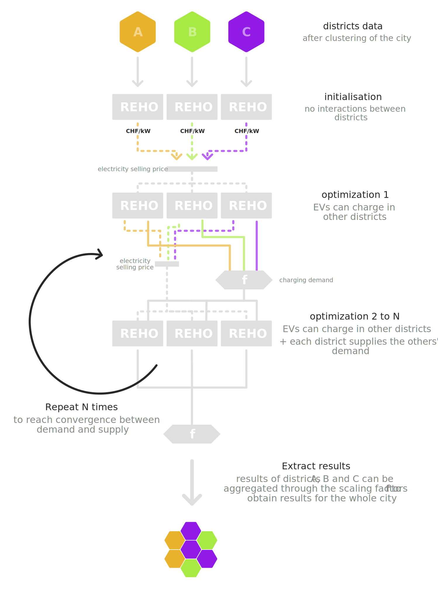

Examples
++++++++

This section reproduces the examples provided in the repository (these examples scripts are available in https://github.com/IPESE/REHO/tree/main/scripts/examples).

They should give you a brief overview of REHO's capabilities and to test the various features of the tool.

.. note::
    Since the content of the ``scripts/examples/`` subfolder is git-tracked, you should not modify these files directly, but rather copy their contents into any other subfolder of ``scripts/`` that you have yourself created. The content there (code, data, results, and figures) will be ignored by the git versioning.

1. Building-scale
--------------------

Single-optimization
====================================
.. literalinclude:: ../../scripts/examples/1a_Building-scale_totex.py
   :language: python

Pareto curve
====================================
.. literalinclude:: ../../scripts/examples/1b_Building-scale_Pareto.py
   :language: python

2. District-scale
--------------------

Single-optimization
====================================
.. literalinclude:: ../../scripts/examples/2a_District-scale_totex.py
   :language: python

Pareto curve
====================================
.. literalinclude:: ../../scripts/examples/2b_District-scale_Pareto.py
   :language: python

3. Specific features
--------------------

Load buildings from a .csv file
====================================
.. literalinclude:: ../../scripts/examples/3a_Read_csv.py
   :language: python

Add diverse energy layers
====================================
.. literalinclude:: ../../scripts/examples/3b_Custom_infrastructure.py
   :language: python

Change heat pump temperature
====================================
.. literalinclude:: ../../scripts/examples/3c_HP_T_source.py
   :language: python

Include electric vehicles
====================================
.. literalinclude:: ../../scripts/examples/3d_EVs.py
   :language: python

Integrate a district heating network
====================================
.. literalinclude:: ../../scripts/examples/3e_DHN.py
   :language: python

Use custom profiles
=====================================
.. literalinclude:: ../../scripts/examples/3f_Custom_profiles.py
   :language: python

Include stochasticity into profiles
====================================
.. literalinclude:: ../../scripts/examples/3g_Stochastic_profiles.py
   :language: python

Fix units size
====================================
.. literalinclude:: ../../scripts/examples/3h_Fix_units.py
   :language: python

Connect to ELCOM database for electricity prices
===========================================================
.. literalinclude:: ../../scripts/examples/3i_Electricity_prices.py
   :language: python

4. Global features
--------------------

Compare various scenarios
====================================
.. literalinclude:: ../../scripts/examples/4a_Progressive_scenarios.py
   :language: python

Conduct a sensitivity analysis
====================================
.. literalinclude:: ../../scripts/examples/4b_Sensitivity_analysis.py
   :language: python

5. Photovoltaics
--------------------

Consider roofs orientation
====================================
.. literalinclude:: ../../scripts/examples/5a_PV_orientation.py
   :language: python

Include photovoltaics on facades
====================================
.. literalinclude:: ../../scripts/examples/5b_PV_facades.py
   :language: python

6. Mobility
--------------------

Add Mobility Layer
====================================
The Layer *Mobility* differs slightly from the other Layers in REHO as this energy carrier is expressed in passenger-kilometers (:math:`pkm`) rather than :math:`kWh`. 
The mobility demand is represented through an hourly passenger-kilometer (:math:`pkm`) profile for each typical day, similarly to the other end-use demand profiles. 
The transport units represented in the model include EVs, ICEs, bikes, electric bikes and public transport. The model can optimize between the different transport modes. However, it is for now recommended to constrain the modal split, as the optimization based on cost does not reflect typical usage of the different transport modes. The `FSO reports <https://www.are.admin.ch/are/fr/home/mobilite/bases-et-donnees/mrmt.html>`_ can be used to find suitable modal split data. 

.. literalinclude:: ../../scripts/examples/6a_mobility_sector.py
   :language: python

Co-optimization
====================================
Multiple districts can be optimized together in order to calculate EV charging exchanges between districts. 
This feature can be used to conduct analyses on EV fleets at the city scale.  
Examples 6b and 6c demonstrate how to use this feature step by step. In example 6b, only one district is optimized with external charging option available. The optimized district is also parametrized with a load on EV charger representing incoming EVs from other districts. Example 6c describes how to optimize a whole city based on 3 typical districts (resulting from clustering). 

   Flowchart process of a city co-optimization (example 6c)