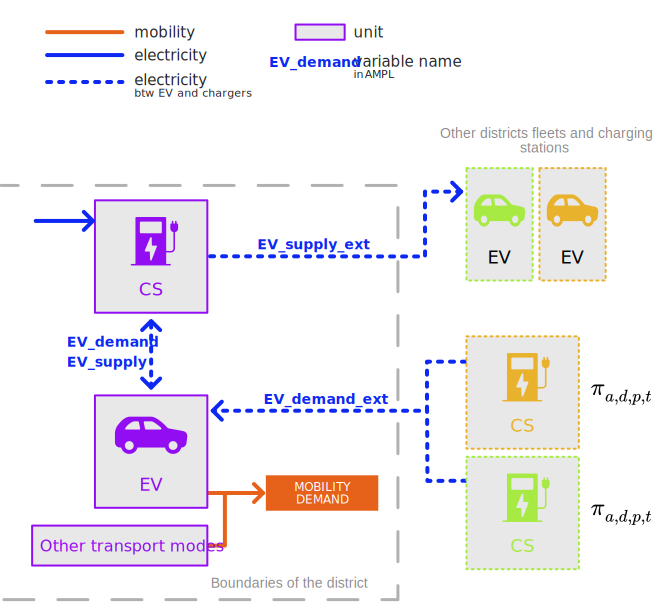

Appendix
+++++++++++++++++

In REHO, most of the model parameters can be given through additional files. However, there are default values
already implemented in the model. This appendix attempts to report them.

Units
======

To define the units' costs, the price per unit installed and the unit lifetime are considered.
They are reported in Tables :ref:`tbl-building-units-csv` and :ref:`tbl-district-units-csv`.

.. csv-table:: Building units default costs and LCA values
   :file: ../../reho/data/infrastructure/building_units.csv
   :header-rows: 1
   :delim: ;
   :class: longtable
   :name: tbl-building-units-csv

.. csv-table:: District units default costs and LCA values
   :file: ../../reho/data/infrastructure/district_units.csv
   :header-rows: 1
   :delim: ;
   :class: longtable
   :name: tbl-district-units-csv

Grids
======

.. csv-table:: Grid costs and LCA values
   :file: ../../reho/data/infrastructure/grids.csv
   :header-rows: 1
   :delim: ;
   :class: longtable
   :name: tbl-grid

Mobility
=========

.. csv-table:: Metadata of hourly daily profiles for the mobility sector
   :file: ../../reho/data/mobility/dailyprofiles_metadata.csv
   :header-rows: 1
   :delim: ,
   :class: longtable
   :name: tbl-dailyprofiles

   A focus on mobility units and streams at the district-level 