Package structure
+++++++++++++++++

This page describes how the REHO package is laid out and what each part is
responsible for, then gives the :ref:`api-reference`: the documentation of every
module, class and function, generated from the docstrings.

.. contents::
   :local:
   :depth: 2

Two languages, one model
========================

REHO exploits the benefits of two programming languages:

* **AMPL:** the core optimization model, holding the objectives, constraints and
  modelling equations (energy balance, mass balance, heat cascade, etc.).
* **Python:** the data-management layer used to initialize the model, execute the
  optimization and retrieve the results. All input and output data is passed to the
  AMPL model through `amplpy <https://pypi.org/project/amplpy/>`_, the Python API
  for AMPL.

The separation is deliberate: the mathematical formulation stays declarative and
readable in ``.mod`` files, while everything that reads a file, calls a database or
reshapes a DataFrame stays in Python.

.. _architecture:

   Diagram of REHO architecture

:ref:`architecture` illustrates REHO's architecture, which can be distinguished
into three parts:

* **Preprocessing:** generation of end-use demand profiles, and characterization of
  equipment and resources.
* **Optimization:** MILP Dantzig-Wolfe decomposition algorithm, with the master
  problem (MP) and the sub-problems (SPs).
* **Postprocessing:** list of energy-system configurations and related KPIs.

Layout at a glance
==================

.. list-table::
   :header-rows: 1
   :widths: 30 70

   * - Path
     - Responsibility
   * - ``reho/__init__.py``
     - Public API: ``REHO``, ``QBuildingsReader``, ``initialize_units``, ``initialize_grids``, ...
   * - ``reho/paths.py``
     - Where the shipped data and model files are, and how to read a tabular file.
   * - ``reho/logger.py``
     - Logging configuration. REHO never writes to ``stdout`` directly.
   * - ``reho/model/reho.py``
     - :class:`~reho.model.reho.REHO`: single optimization, Pareto front, results and KPIs.
   * - ``reho/model/master_problem.py``
     - :class:`~reho.model.master_problem.MasterProblem`: the district-scale decomposition.
   * - ``reho/model/sub_problem.py``
     - :class:`~reho.model.sub_problem.SubProblem`: one building's MILP.
   * - ``reho/model/actors_problem.py``
     - :class:`~reho.model.actors_problem.ActorsModel`: the multi-stakeholder formulation.
   * - ``reho/model/infrastructure.py``
     - Units, layers, grids and streams: the sets and parameters describing the system.
   * - ``reho/model/options.py``
     - Defaults and validation of ``method``, ``scenario`` and ``DW_params``.
   * - ``reho/model/ampl_interface.py``
     - AMPL sessions, solver options, and the technology-to-``.mod`` registries.
   * - ``reho/model/ampl_model/``
     - The AMPL formulation itself.
   * - ``reho/model/preprocessing/``
     - Everything that produces model inputs: buildings, weather, profiles, prices.
   * - ``reho/model/postprocessing/``
     - Everything that reads model outputs: results DataFrames, KPIs, exports.
   * - ``reho/plotting/``
     - Figures: Sankey diagrams, Pareto fronts, load profiles, performance bars.
   * - ``reho/data/``
     - Reference data shipped with the package, see :doc:`data/input`.
   * - ``reho/test/``
     - The test-suite, see :ref:`testing`.

**model/**
==========

**ampl_model/**
---------------

Core of the optimization model (objectives, constraints, modelling equations),
containing all AMPL files:

- ``sub_problem.mod`` declares the parameters and variables of a building's energy
  system and its constraints (energy balance, mass balance, heat cascade, ...).
  This is the core of the MILP model.
- ``master_problem.mod`` models the district-scale coordination problem of the
  decomposition approach.
- ``actors_problem.mod`` models the stakeholders (responsibilities, interactions,
  limitations), and ``actors_mobility.mod`` the mobility costs of the renters, read
  only when the district includes electric vehicles.
- ``scenario.mod`` holds the objective functions, the epsilon constraints, and the
  optional constraints that can be enabled to model a particular scenario.
- ``units/`` contains one model file per technology. Two sub-folders group them:
  ``district_units/`` for the technologies shared by a district, and
  ``interperiod/`` for storage chained across typical periods.

Which of these files are read depends on the units present in the problem. The
mapping is data, not code: see :data:`reho.model.ampl_interface.BUILDING_UNIT_MODELS`
and :data:`~reho.model.ampl_interface.DISTRICT_UNIT_MODELS`. Adding a technology is
therefore a matter of adding a row to a CSV file, a ``.mod`` file, and one entry to a
registry — see :ref:`adding-a-technology`.

**preprocessing/**
------------------

Turns the description of a case study into the sets and parameters the AMPL model
expects.

.. list-table::
   :header-rows: 1
   :widths: 30 70

   * - Module
     - Responsibility
   * - :mod:`~reho.model.preprocessing.QBuildings`
     - Read the buildings, from the QBuildings database or from a CSV file.
   * - :mod:`~reho.model.preprocessing.local_data`
     - Location-dependent data: weather, sun position, renovation references.
   * - :mod:`~reho.model.preprocessing.weather`
     - Download annual weather data and reduce it to typical periods.
   * - :mod:`~reho.model.preprocessing.clustering`
     - K-medoids clustering used by the typical-period reduction.
   * - :mod:`~reho.model.preprocessing.buildings_profiles`
     - End-use demand profiles (heat gains, domestic hot water, electricity).
   * - :mod:`~reho.model.preprocessing.sia_parser`
     - Read the SIA 2024 / SIA 380-1 norms behind those profiles.
   * - :mod:`~reho.model.preprocessing.skydome`
     - Discretize the sky into patches, for the oriented PV model.
   * - :mod:`~reho.model.preprocessing.electricity_prices`
     - Retail and injection electricity prices from the ELCOM database.
   * - :mod:`~reho.model.preprocessing.mobility_generator`
     - Mobility demand and electric-vehicle availability profiles.
   * - :mod:`~reho.model.preprocessing.renovation`
     - Post-renovation U-values, costs and embodied emissions.
   * - :mod:`~reho.model.preprocessing.actors`
     - Stakeholder parameters of the actors formulation.

**postprocessing/**
-------------------

.. list-table::
   :header-rows: 1
   :widths: 30 70

   * - Module
     - Responsibility
   * - :mod:`~reho.model.postprocessing.write_results`
     - Extract the AMPL solution into the ``df_*`` DataFrames, see :doc:`data/output`.
   * - :mod:`~reho.model.postprocessing.KPIs`
     - Compute the key performance indicators and the economic breakdown.
   * - :mod:`~reho.model.postprocessing.sensitivity_analysis`
     - Morris and Sobol sensitivity analyses over the model inputs.
   * - :mod:`~reho.model.postprocessing.osmose`
     - Export the heat-cascade streams to the OSMOSE process-integration platform.

**plotting/**
=============

Visualization of the results. ``plotting.py`` holds the figure functions,
``sankey.py`` builds the energy-flow diagram, and ``utils.py`` holds the shared
helpers. Two reference tables drive the appearance of every figure:

- ``layout.csv``: colors and labels for each unit and layer of an energy-system
  configuration;
- ``sia380_1.csv``: translation of a building's affectation from Roman numbering to
  the SIA 380/1 labels.

**data/**
=========

Reference data shipped with the package: energy-system technologies, energy
layers with their tariffs and emission factors, building norms, mobility profiles
and sky discretization.
Each file, its columns and its provenance are documented in :doc:`data/input`.

.. _api-reference:

API reference
=============

Generated from the docstrings of the package, in the NumPy style.

Entry points
------------

The objects a run script needs are re-exported at the top level::

    from reho import REHO, QBuildingsReader, initialize_grids, initialize_units

.. autosummary::
   :nosignatures:

   reho.model.reho.REHO
   reho.model.actors_problem.ActorsModel
   reho.model.preprocessing.QBuildings.QBuildingsReader
   reho.model.infrastructure.initialize_units
   reho.model.infrastructure.initialize_grids
   reho.model.infrastructure.Infrastructure
   reho.logger.configure_logging

Configuration
-------------

.. autosummary::
   :nosignatures:

   reho.model.options.initialize_default_methods
   reho.model.options.initialize_default_scenario
   reho.model.options.initialise_DW_params

Modules
-------

One page per module, with the full documentation of its classes, functions and
constants. The test-suite is presented in the :ref:`testing` section of the
developer guide.

.. autosummary::
   :recursive:
   :toctree: _autosummary

   reho
