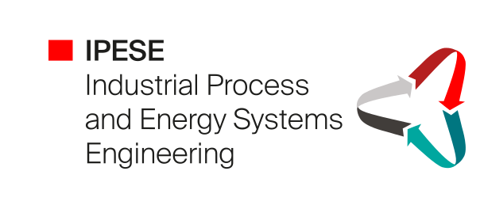

.. REHO documentation master file

.. to build :
..      cd documentation
..      make html

Renewable Energy Hub Optimizer
==============================

Renewable Energy Hub Optimizer (REHO) is a decision support tool for sustainable urban energy system planning.

It is developed by EPFL (Switzerland), within the Industrial Process and Energy Systems Engineering (IPESE) group.

REHO simultaneously addresses the optimal design and operation of capacities, catering to multi-objective
considerations across economic, environmental, and efficiency criteria. Its MILP framework, multi-objective
optimization, multi-scale adaptability, consideration of diverse end-use demands, and multi-energy integration drive
informed decision-making for renewable energy deployment in urban areas.

This documentation introduces REHO and highlights its key features and contributions to the field of
sustainable energy system planning.

.. figure:: images/energy_hub_v1.svg

Contents
=========

.. toctree::
   :maxdepth: 1

   sections/1_Overview/Overview
   sections/2_Releases/Releases
   sections/3_Model/Model
   sections/4_Package_structure/Package_structure
   sections/5_Getting_started/Getting_started
   sections/6_Examples/Examples
   sections/Input data
   sections/Bibliography

.. Indices and tables
   ==================
   * :ref:`genindex`
   * :ref:`modindex`
   * :ref:`search`

Downloading REHO
=======================

REHO is available as an open-source and collaborative Python library.

It is deployed as a PyPI package (https://pypi.org/project/REHO/) and can be installed with:

.. code-block:: bash

   pip install REHO

The developer version can be accessed from its GitHub repository (https://github.com/IPESE/REHO) and installed with:

.. code-block:: bash

   git clone https://github.com/IPESE/REHO.git

Main contributors
=================

* Paul **Stadler** (2016-2019)
* Luise **Middelhauve** (2018-2021)
* Dorsan **Lepour** (2020-...)
* Cédric **Terrier** (2021-...)
* Joseph **Loustau** (2022-...)

