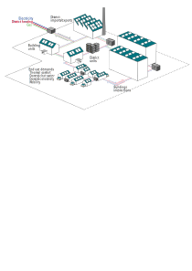
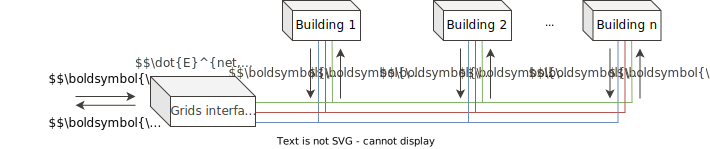

.. _sec_model:

Model
+++++

.. caution::

    Focus on the energy model and mathematical background of REHO

    Bottom-up approach (building-level --> district-level)

    .. Top-down approach (district --> buildings --> units + heat cascade)

The energy hub concept is used to model an energy community where multi-energy carriers can supply diverse end use demands through building units and district units optimally interconnected and operated.
:ref:`energy_hub_v2` displays the input data necessary to characterize a district-level energy hub to be optimized with REHO:

- the geographic boundaries of the considered territory;
- the end use demands, resulting from the building stock and local weather;
- the technologies available and their specifications regarding cost, life cycle, efficiency;
- the endogenous resources;
- and the energy market prices for district imports and exports.

The optimal solution minimizing the specified objective function will then be fully characterized by the decision variables defining the energy system configuration. These decision variables are the installed capacities of the building and district units among the available technologies, their operation throughout a typical year, and the resulting energy flows (buildings interactions and district imports/exports).

.. _energy_hub_v2:

   District energy hub model in REHO

Building model
===========================

.. caution::
    Describe equations

Energy system
-------------------

Sizing constraints
~~~~~~~~~~~~~~~~~~~~~~~~

The main equation for sizing and scheduling problem units are  described by:

.. math::
    \begin{align}
    \boldsymbol{y_{b,u}}  \cdot  F_u^{min}  &\leq  \boldsymbol{f_{b,u}} \leq \boldsymbol{y_{b,u}}  \cdot  F_u^{max}   \\
    \boldsymbol{f_{b,u,p,t}} &\leq  \boldsymbol{f_{b,u}}\\
    \boldsymbol{y_{b,u,p,t}} &\leq  \boldsymbol{y_{b,u}}\\
    & \quad \forall b \in  \text{B} \quad \forall u \in  \text{U}  \quad \forall p \in  \text{P} \quad \forall t\in  \text{T} \nonumber
    \end{align}

Energy balance
~~~~~~~~~~~~~~~~~~~~~~~~

The energy system of the building includes all the different unit technologies that are used to fulfil the building's energy demand.

.. math::
    \begin{align}
    \boldsymbol{\dot{E}_{b,p,t}^{gr,+}}  +  \sum_{u \in \text{U}} \boldsymbol{ \dot{E}_{b,u,p,t}^{+}} &= \boldsymbol{\dot{E}_{b,p,t}^{gr,-}}+ \sum_{u \in \text{U}} \boldsymbol{\dot{E}_{b,u,p,t}^{-}} + \dot{E}_{b, p, t}^{B,-} \label{eq_ch1:Ebalance}  \\
    \boldsymbol{\dot{H}_{b,p,t}^{gr,+}}  &=  \sum_{u \in \text{U}} \boldsymbol{\dot{H}_{b,u,p,t}^{-}}  \qquad  \qquad \quad \forall b \in  \text{B} \quad \forall p \in  \text{P} \quad \forall t\in  \text{T} \label{eq_ch1:Hbalance}
    \end{align}

Heat cascade
~~~~~~~~~~~~~~~~~~~~~~~~

.. math::
    \begin{align}
    \boldsymbol{\dot{R}_{k,b,p,t} }- \boldsymbol{ \dot{R}_{k+1,b,p,t}}  &=  \sum_{u_h \in \text{S}_h} \boldsymbol{\dot{Q}_{u_h,k,b,p,t}^{-}}- \sum_{u_c \in \text{S}_c} \boldsymbol{\dot{Q}_{u_c,k,b,p,t}^{+}} \label{eq_ch1:heatK1}\\
    \boldsymbol{\dot{R}_{1,b,p,t}}&= \boldsymbol{\dot{R}_{n_k+1,b,p,t}} = 0  \qquad \qquad  \forall k \in  \text{K} \quad \forall b \in  \text{B} \quad \forall p \in  \text{P} \quad \forall t\in  \text{T} \label{eq_ch1:heatK2}
    \end{align}

Energy demand
-------------------

Space heating
~~~~~~~~~~~~~~~~~~~~~~~~

The general form of the SH demand can be expressed by the first order dynamic model of buildings:

.. math::
    \boldsymbol{\dot{Q}_{b,p,t}^{SH}} = \dot{Q}_{b,p,t}^{gain} - U_b  \cdot A^{era}_b \cdot (\boldsymbol{T^{int}_{b,p,t}} - T^{ext}_{p,t}) - C_b \cdot A^{era}_b \cdot (\boldsymbol{T^{int}_{b,p,t+1}} - \boldsymbol{T^{int}_{b,p,t}})  \quad \forall b \in  \text{B} \quad \forall p \in  \text{P} \quad \forall t\in  \text{T}

.. math::
    \dot{Q}^{gain}_{b,p,t}  = \dot{Q}^{int}_{b,p,t} + \dot{Q}^{irr}_{b,p,t}\quad \forall b \in  \text{B} \quad \forall p \in  \text{P} \quad \forall t\in  \text{T}

.. math::
    \dot{Q}^{int}_{b,p,t}  = A^{net}_b \cdot \sum_{r \in Rooms} f_{b,r} \cdot f^{u}_{r,p}  \cdot (\Phi^{P}_{r,p,t} + \Phi^{A+L}_{r,p,t}) \quad \forall b \in  \text{B} \quad \forall p \in  \text{P} \quad \forall t\in  \text{T}

.. math::
    \dot{Q}^{irr}_{b,p,t}  = A^{era}_b \cdot \phi^{irr} \cdot \dot{irr}^{ghi}_{b,p,t} \quad \forall b \in  \text{B} \quad \forall p \in  \text{P} \quad \forall t\in  \text{T}

Domestic hot water
~~~~~~~~~~~~~~~~~~~~~~~~

Typical DHW demand is stated in standardized national norms. Similar to the internal heat gains, the DHW profile is specific to each room type and usage.

.. math::
    {Q}^{dhw,-}_{b} = A^{net}_b \cdot \sum_{r \in Rooms} f_{b,r}\cdot f^{u}_{r,p} \cdot V^{dhw,ref}_{r}  \cdot \frac{n^{ref}}{A^{net}_r}\cdot c_p^{dhw} \cdot \rho^{dhw} ( T^{dhw} - T^{cw})  \quad \forall b \in  \text{B}

Domestic electricity
~~~~~~~~~~~~~~~~~~~~~~~~

When measured data is not available, the electricity demand can be calculated based on the profiles provided by national standard norms.

.. math::
    \dot{E}^{B}_{b,p,t}  = A^{net}_b \cdot \sum_{r \in Rooms} f_{b,r} \cdot f^{u}_{r,p}  \cdot  \dot{e}^{A+L}_{r,p,t} \quad \forall b \in  \text{B} \quad \forall p \in  \text{P} \quad \forall t\in  \text{T}

Building-level units
------------------------

.. caution::
    TODO

Objective functions
----------------------

Annual operating expenses
~~~~~~~~~~~~~~~~~~~~~~~~~~~~

.. math::
    \boldsymbol{C^{op}_b} =  \sum_{p \in \text{P}} \sum_{t \in \text{T}} \left(  c^{el, +}_{p,t} \cdot \boldsymbol{ \dot{E}^{gr,+}_{b,p,t} } -  c^{el,-}_{p,t}\cdot \boldsymbol{ \dot{E}^{gr,-}_{b,p,t} } +  c^{ng,+}_{p,t} \cdot \boldsymbol{\dot{H}^{gr,+}_{b,p,t} } \right) \cdot d_t \cdot d_p  \quad \forall b \in  \text{B}

Annual capital expenses
~~~~~~~~~~~~~~~~~~~~~~~~~~~~

.. math::
    \begin{align}
         \boldsymbol{C^{cap}_b} &=   \frac{i(1+i)}{(1+i)^n -1} \cdot \left(\boldsymbol{C^{inv}_b } +  \boldsymbol{C^{rep}_b } \right) \label{eq_ch1:Ccap}\\
         \boldsymbol{C^{inv}_b }&= \sum_{u \in \text{U}}   b_{u} \cdot \left( i^{c1}_{u} \cdot \boldsymbol{y_{b,u}} + i^{c2}_{u} \cdot \boldsymbol{f_{b,u}} \right) \label{eq_ch1:Cinv}\\
         \boldsymbol{C^{rep}_b} &=   \sum_{u \in \text{U}}  \sum_{r \in \text{R}}  \frac{1}{\left( 1 + i \right)^{r \cdot l_u}}  \cdot \left( i^{c1}_{u} \cdot \boldsymbol{y_{b,u}} + i^{c2}_{u} \cdot \boldsymbol{f_{b,u}} \right)   \quad \forall b \in  \text{B} \label{eq_ch1:Crep}
    \end{align}

Annual total expenses
~~~~~~~~~~~~~~~~~~~~~~~~~~~~

.. math::
    \boldsymbol{C^{tot}_b} =  \boldsymbol{C^{cap}_b} +  \boldsymbol{C^{op}_b} \quad \forall b \in \text{B}

Global warming potential
~~~~~~~~~~~~~~~~~~~~~~~~~~~~

.. math::
    \boldsymbol{G^{op}_b} = \sum_{p \in \text{P}} \sum_{t\in \text{T}}  \left( g^{el}_{p,t} \cdot \boldsymbol{\dot{E}^{gr,+}_{b,p,t}} - g^{el}_{p,t} \cdot \boldsymbol{\dot{E}^{gr,-}_{b,p,t}} + g^{ng} \cdot \boldsymbol{\dot{H}^{gr,+}_{b,p,t}} \right) \cdot d_p \cdot d_t \quad \forall b \in  \text{B}

.. math::
    \boldsymbol{G^{bes}_b }= \sum_{u \in \text{U}}  \frac{1}{l_u}\cdot   \left( i^{g1}_u \cdot \boldsymbol{y_{b,u}} + i^{g2}_u\cdot \boldsymbol{f_{b,u}} \right) \quad \forall b \in \text{B}

.. math::
    \boldsymbol{G^{tot}_b} = \boldsymbol{G^{bes}_b} +  \boldsymbol{G^{op}_b} \quad \forall b \in \text{B}

Key performance indicators
----------------------------------

.. caution::
    TODO

District model
===========================

Master problem
-------------------

.. math::
    \begin{align}
       0 \leq  \boldsymbol{\lambda_{i,b}} & \leq 1   \quad \forall i \in \text{I}, \quad \forall b \in \text{B}  \label{eq_ch4:convex_1}\\
        \sum_{i \in \text{I}}  \boldsymbol{\lambda_{i,b}} &= 1 \quad \forall b \in \text{B} \quad \backsim [\mu_b] \label{eq_ch4:convex_2}\
    \end{align}

.. math::
    \sum_{i \in \text{I}} \sum_{b \in \text{B}} \boldsymbol{\lambda_{i,b}} \cdot    \left(  \dot{E}^{gr,+}_{i,b,p,t}  -   \dot{E}^{gr,-}_{i,b,p,t} \right)  \cdot d_p \cdot d_t  = \boldsymbol{E^{TR,+}_{p,t}} - \boldsymbol{ E^{TR,-}_{p,t} }\quad \forall p \in \text{P}, \quad \forall t \in \text{T} \quad \backsim [\pi_{p,t}]

.. math::
    \boldsymbol{C^{el}} =  \sum_{p \in \text{P}} \sum_{t \in \text{T}}  \left(  c^{el, +}_{p,t} \cdot  \boldsymbol{E^{TR,+}_{p,t}}  -  c^{el,-}_{p,t}\cdot \boldsymbol{ E^{TR,-}_{p,t}} \right)

.. math::
    \boldsymbol{G^{el}} = \sum_{p \in \text{P}} \sum_{t\in \text{T}}  \left( g^{el}_{p,t} \cdot \boldsymbol{E^{TR,+}_{p,t}} - g^{el}_{p,t} \cdot \boldsymbol{E^{TR,-}_{p,t}}  \right)

.. math::
    \begin{align}
        \boldsymbol{C^{op}} &=  \boldsymbol{C^{el}} + \sum_{i \in \text{I}} \sum_{b \in \text{B}} \boldsymbol{\lambda_{i,b}} \cdot  C^{gas}_{i,b} \label{eq_ch4:opex}  \\
        \boldsymbol{C^{cap}} &=  \sum_{i \in \text{I}} \sum_{b \in \text{B}} \boldsymbol{\lambda_{i,b}} \cdot  C^{cap}_{i,b} \label{eq_ch4:capex} \\
        \boldsymbol{C^{tot}} &=    \boldsymbol{C^{cap}} +  \boldsymbol{C^{op}} \label{eq_ch4:totex}\\
        \boldsymbol{G^{tot}} &=    \boldsymbol{G^{el}} +   \sum_{i \in \text{I}} \sum_{b \in \text{B}} \boldsymbol{\lambda_{i,b}} \cdot  \left(G^{gas}_{i,b} + G^{bes}_{i,b}    \right) \label{eq_ch4:GWP}
    \end{align}

Transformer constraints
--------------------------

.. _network_diagram:

   Energy flows and network constraints in REHO

:ref:`energy_hub_v2` distinguishes the:

- Grid = energy flows within the district boundary
- Network = exchanges with the district exterior, through the interface (transformer perspective)

.. math::
        \begin{align}
            &\sum_{b \in \text{B}}   (\boldsymbol{\dot{E}^{gr,+}_{b,l,p,t}} - \boldsymbol{\dot{E}^{gr,-}_{b,l,p,t}})  \cdot d_p \cdot d_t  = \boldsymbol{E^{net,+}_{l,p,t}} - \boldsymbol{ E^{net,-}_{l,p,t} }         \qquad \forall l, p, t \in \text{L, P, T}
            \label{grid constraints}\\
            &\boldsymbol{\dot{E}^{net,\pm}_{l,p,t}}  \leq  \dot{E}^{net, max}_l \qquad \forall l, p, t \in \text{L, P, T}
            \label{Transformer max}
        \end{align}

District-level units
------------------------

.. caution::
    TODO

Objective functions
----------------------

.. math::
    \begin{align}
        &\boldsymbol{TOTEX} = \boldsymbol{OPEX} + \boldsymbol{CAPEX}
        \label{totex}\\
        &\boldsymbol{OPEX} = \sum_{\substack{l\in L}} c^+_l \cdot \boldsymbol{E^{net, +}_l} -c^-_l \cdot \boldsymbol{E^{net, -}_l}
    	\label{opex}\\
    	&\boldsymbol{CAPEX} = \frac{i(1+i)}{(1+i)^n-1}(\boldsymbol{C^{inv}}+\boldsymbol{C^{rep}})
        \label{capex}\\
        &\boldsymbol{C^{inv}} = \sum_{\substack{u\in U}}b_u\cdot(i^{c1}_u\cdot \boldsymbol{y_u}+i^{c2}_u\cdot \boldsymbol{f_u})
        \label{cinv}\\
        &\boldsymbol{C^{rep}} = \sum_{\substack{u\in U}}\sum_{\substack{r\in R}}\frac{1}{(1+i)^{r\cdot l_u}}\cdot(i^{c1}_u\cdot \boldsymbol{y_u}+i^{c2}_u\cdot \boldsymbol{f_u})
        \label{crep}
    \end{align}

