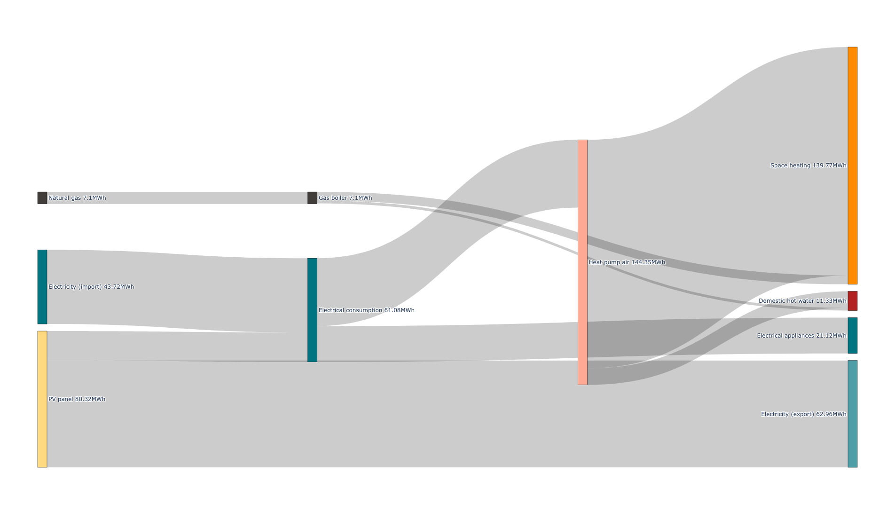

Getting started
++++++++++++++++

.. grid:: 1 2 2 2
    :gutter: 4

    .. grid-item-card:: Part-Time User? 😎
        :class-card: install-card
        :columns: 12 12 6 6
        :padding: 3

        REHO is available as a `PyPI package <https://pypi.org/project/REHO/>`__
        and can be installed via pip with:

        ++++++++++++++++++++++

        .. code-block:: bash

            pip install --extra-index-url https://pypi.ampl.com REHO

    .. grid-item-card:: Talented Developer? 🏄
        :class-card: install-card
        :columns: 12 12 6 6
        :padding: 3

        Full code can be accessed from the `REHO repository <https://github.com/IPESE/REHO>`__
        and project cloned using the command:

        ++++

        .. code-block:: bash

            git clone https://github.com/IPESE/REHO.git

Prerequisites
=============

Python 3
------------------

You will need `Python3 <https://www.python.org/downloads/>`_, just pick the latest version.
As IDE we recommend to use `PyCharm <https://www.jetbrains.com/pycharm/>`_.

AMPL
------------------

As REHO is based on AMPL, it requires a licence of AMPL and at least one LP solver.

- The `AMPL Community Edition <https://ampl.com/ce/>`_ offers a free, full-powered AMPL license for personal, academic, and commercial-prototyping use.
- The `HiGHS <https://highs.dev/>`_ solver is automatically installed via the `amplpy <https://amplpy.ampl.com/en/latest/>`_ library and REHO's requirements, and is chosen by default by the ``REHO()`` constructor when performing an optimization.
- However, using the `Gurobi <https://www.gurobi.com/>`_ solver reduces calculation time by a factor of 3, and its use is therefore recommended.

Plenty of text editors exist which feature AMPL. We recommend using `Sublime Text <https://www.sublimetext.com/>`_, which provides the `AMPL Highlighting package <https://github.com/JackDunnNZ/sublime-ampl>`_.

AMPL license path
~~~~~~~~~~~~~~~~~~

You need to include a ``.env`` file at the project root folder. This one should contain the path to your AMPL license (cf. file ``example.env``):

.. code-block:: bash

   AMPL_PATH = "path_to_your_license"

.. warning:: Running code from VScode or Terminal

    Running scripts from VScode or from a standalone terminal may lead to path issues, either when importing the REHO module or when providing the path to ``.env``.

    Please refer to the instructions in `REHO/Issues/Relative Path in VScode <https://github.com/IPESE/REHO/issues/13>`_.

Installation
============

From PyPI
---------

Command
~~~~~~~

Select the project root containing a Python environment and install the latest stable release of REHO with:

.. code-block:: bash

    pip install --extra-index-url https://pypi.ampl.com REHO

Checking proper installation
~~~~~~~~~~~~~~~~~~~~~~~~~~~~~

Entry points allow to verify the proper intallation of REHO. Select the desired folder and type:

.. code-block:: bash

    reho-run-test

.. code-block:: bash

    reho-plot-test

.. code-block:: bash

    reho-examples-test

These commands will download files from the ``reho/test/`` and ``scripts/examples/`` folders from the `repository <https://github.com/IPESE/REHO/tree/main/scripts/examples>`__, copy them locally and execute them.

If your installation is correct, you should:

- See the results of the optimizations in the terminal.
- See files appear in the newly created subfolders ``data/clustering/``, ``results/`` and ``figures/``.
- Have an overview of the results in your web browser (different tabs showing figures such as below).

   Sankey diagram resulting from a basic REHO single-optimization.

.. figure:: ../images/performance.png
   :width: 1000
   :align: center
   :name: sankey

   Economical performance resulting from a REHO multi-objective optimization (Pareto).

From source
------------------

Command
~~~~~~~

Select your project directory and clone the REHO repository with:

.. code-block:: bash

    git clone https://github.com/IPESE/REHO.git

.. warning::
    The REHO repository can be forked or cloned depending on the intended use. If you simply clone the repository do not forget to check out your own branch from the ``main``.

Requirements
~~~~~~~~~~~~~~~~~~

Please include a ``venv`` at the project root folder and install dependencies with:

.. code-block:: bash

   pip install -r requirements.txt

.. warning::
    The ``psycopg2`` dependency is known to cause some issues, as some prerequisites are frequently missing (i.e. the PostgreSQL library and Python development tools). For Windows users, the binary wheel ``psycopg2-binary`` is already specified in REHO's requirements so this should no longer be an issue.

    For Linux and Mac users, 2 options are suggested:

    1. Try to install the ``psycopg2-binary`` instead:

    .. code-block:: bash

        pip install psycopg2-binary

    2. Install the prerequisites for building ``psycopg2`` from source:

    .. grid:: 1 2 2 2
        :gutter: 4

        .. grid-item-card:: Linux users
            :class-card: install-card
            :columns: 12 12 6 6
            :padding: 3

            .. code-block:: bash

                sudo apt install python3-dev libpq-dev

        .. grid-item-card:: Mac users
            :class-card: install-card
            :columns: 12 12 6 6
            :padding: 3

            .. code-block:: bash

                brew install postgresql

    You may refer to `How to install psycopg2 with "pip" on Python? <https://stackoverflow.com/questions/5420789/how-to-install-psycopg2-with-pip-on-python/5450183#5450183>`__ for further investigations.

Checking proper installation
~~~~~~~~~~~~~~~~~~~~~~~~~~~~~

Run ``reho/test/test_run.py``, ``reho/test/test_plot.py`` or any of the files in ``scripts/examples/``.

If your installation is correct, each run should end with *“Process finished with exit code 0”*.
Some files will also render some results in your web browser and open different tabs showing the outcome of your optimization.

.. warning::
    In ``scripts/examples/``, the solver is explicitly defined as Gurobi to reduce calculation time. Simply remove the ``REHO(solver="gurobi")`` argument and it will by default substitute the open-source solver HiGHS.

Git tracking
~~~~~~~~~~~~~

You will also see some files appear in some newly created subfolders such as ``data/clustering/``, ``results/`` and ``figures/``. These are not git-tracked. But all the other Python files in ``scripts/examples/`` are git-tracked.

You should then be careful to not modify the content of these files.

However, for your future work and own case-studies with REHO, you can create any additional subfolders in ``scripts/``. These will be ignored by the git versioning.

Running REHO
================

The following paragraphs describe the content of ``reho/test/test_run.py`` and ``reho/test/test_plot.py``. These latter should allow you to get started with the tool and conduct your first optimizations.

.. literalinclude:: ../../reho/test/test_run.py
   :language: python

.. literalinclude:: ../../reho/test/test_plot.py
   :language: python

Set building parameters
---------------------------

Each building needs to be characterized to estimate its energy demand, its renewable potential, and its sector coupling potential.
Such information about the buildings involved in the analysis can be provided to REHO in two different ways:

1. By connecting to the `QBuildings database <https://ipese-web.epfl.ch/lepour/qbuildings/index.html>`_ ;
2. By reading CSV files.

QBuildings
~~~~~~~~~~~~~~~~~

QBuildings is a GIS database for the characterization of the Swiss building stock from an energy point of view (end-use demand, buildings morphology, endogenous resources).
It is built by gathering different public databases and combining them with SIA norms.
It was initiated and developed by EPFL (Switzerland), within the Industrial Process and Energy Systems Engineering (IPESE) group.

REHO can connect to QBuildings and read the data it contains with the following code:

.. code-block:: python

    reader = QBuildingsReader()                             # load QBuildingsReader class
    reader.establish_connection('Geneva')                   # connect to QBuildings database
    qbuildings_data = reader.read_db(71, egid=['1009515'])  # read data

See :meth:`reho.model.preprocessing.QBuildings.QBuildingsReader.read_db` for further description.

.. warning::
    The QBuildings-Suisse database will soon be available for full access. At present, you need to be connected to EPFL intranet to access the complete database.

    However, a reduced version (QBuildings-Geneva) is already available to the public and serves as a demo for all the examples.

CSV files
~~~~~~~~~~~~~~~~~

The buildings information can also be provided through a CSV file, with the call:

.. code-block:: python

    reader = QBuildingsReader()
    qbuildings_data = reader.read_csv(buildings_filename='data/buildings.csv', nb_buildings=2)

See :meth:`reho.model.preprocessing.QBuildings.QBuildingsReader.read_csv` for further description.

.. warning::
    To work properly, the .csv given should contain the same fields as the ones defined in QBuildings.

    The order does not matter. It can be helpful to explore the files ``scripts/examples/data/buildings.csv``,
    ``scripts/examples/data/roofs.csv`` and ``scripts/examples/data/facades.csv``.

Buildings input data
~~~~~~~~~~~~~~~~~~~~~

.. dropdown:: List of buildings parameters
    :icon: list-unordered

    .. table:: Table of mandatory buildings parameters
        :name: tbl-csv-buildings

        +-----------------------------------------+------------------------------------------------------------------------------------------------------------------------------------------------------------------------------------------------------------------------------------+------------------+
        | Parameters                              | Description                                                                                                                                                                                                                        | Example          |
        +=========================================+====================================================================================================================================================================================================================================+==================+
        | id_class                                | Building's class, from :ref:`tbl-sia380`. If several, separate them with   /                                                                                                                                                       | I/II/I           |
        +-----------------------------------------+------------------------------------------------------------------------------------------------------------------------------------------------------------------------------------------------------------------------------------+------------------+
        | ratio                                   | Share of the ERA attributed to each id_class. If one class   should be 1, else should follow the order of the id_class                                                                                                             | 0.4/0.25/0.35    |
        +-----------------------------------------+------------------------------------------------------------------------------------------------------------------------------------------------------------------------------------------------------------------------------------+------------------+
        | status                                  | From SIA2024, characterize the electricity consumption in REHO. Put   'standard' by default.                                                                                                                                       | standard         |
        +-----------------------------------------+------------------------------------------------------------------------------------------------------------------------------------------------------------------------------------------------------------------------------------+------------------+
        | area_era_m2                             | Energetic Reference Area                                                                                                                                                                                                           | 279.4            |
        +-----------------------------------------+------------------------------------------------------------------------------------------------------------------------------------------------------------------------------------------------------------------------------------+------------------+
        | area_facade_m2                          | area of vertical facades                                                                                                                                                                                                           | 348              |
        +-----------------------------------------+------------------------------------------------------------------------------------------------------------------------------------------------------------------------------------------------------------------------------------+------------------+
        | area_roof_solar_m2                      | Roof area suitable for solar panels installation. See   `Sonnendach   <https://www.bfe.admin.ch/bfe/en/home/supply/statistics-and-geodata/geoinformation/geodata/solar-energy/suitability-of-roofs-for-use-of-solar-energy.html>`_ | 148.3            |
        +-----------------------------------------+------------------------------------------------------------------------------------------------------------------------------------------------------------------------------------------------------------------------------------+------------------+
        | height_m                                | Height up to the last ceiling. Use to determine shadowing in   *use_facades*.                                                                                                                                                      | 12.83            |
        +-----------------------------------------+------------------------------------------------------------------------------------------------------------------------------------------------------------------------------------------------------------------------------------+------------------+
        | thermal_transmittance_signature_kW_m2_K | Averaged conductance                                                                                                                                                                                                               | 0.00202          |
        +-----------------------------------------+------------------------------------------------------------------------------------------------------------------------------------------------------------------------------------------------------------------------------------+------------------+
        | thermal_specific_capacity_Wh_m2_K       | Thermal inertia                                                                                                                                                                                                                    | 119.4            |
        +-----------------------------------------+------------------------------------------------------------------------------------------------------------------------------------------------------------------------------------------------------------------------------------+------------------+
        | temperature_interior_C                  | Target temperature to reach                                                                                                                                                                                                        | 20.0             |
        +-----------------------------------------+------------------------------------------------------------------------------------------------------------------------------------------------------------------------------------------------------------------------------------+------------------+
        | temperature_cooling_supply_C            |                                                                                                                                                                                                                                    | 12.0             |
        +-----------------------------------------+------------------------------------------------------------------------------------------------------------------------------------------------------------------------------------------------------------------------------------+------------------+
        | temperature_cooling_return_C            |                                                                                                                                                                                                                                    | 17.0             |
        +-----------------------------------------+------------------------------------------------------------------------------------------------------------------------------------------------------------------------------------------------------------------------------------+------------------+
        | temperature_heating_supply_C            |                                                                                                                                                                                                                                    | 65.0             |
        +-----------------------------------------+------------------------------------------------------------------------------------------------------------------------------------------------------------------------------------------------------------------------------------+------------------+
        | temperature_heating_return_C            |                                                                                                                                                                                                                                    | 50.0             |
        +-----------------------------------------+------------------------------------------------------------------------------------------------------------------------------------------------------------------------------------------------------------------------------------+------------------+

.. dropdown:: List of roofs parameters
    :icon: list-unordered

    .. table:: Table of mandatory roofs parameters
        :name: tbl-csv-roofs

        +--------------------+----------------------------------------------------+------------------+
        | Parameters         | Description                                        | Example          |
        +====================+====================================================+==================+
        | tilt               | Inclination of the roof, in degree                 | 30               |
        +--------------------+----------------------------------------------------+------------------+
        | azimuth            | Orientation of the roof, in degree                 | 12               |
        +--------------------+----------------------------------------------------+------------------+
        | id_roof            | Unique identifier                                  | 1                |
        +--------------------+----------------------------------------------------+------------------+
        | area_roof_solar_m2 | Surface suitable for solar panels                  | 210.3            |
        +--------------------+----------------------------------------------------+------------------+
        | id_building        | Use to identify to which building the roof belongs | 10               |
        +--------------------+----------------------------------------------------+------------------+

.. dropdown:: List of facades parameters
        :icon: list-unordered

        .. table:: Table of mandatory facades parameters
            :name: tbl-csv-facades

            +----------------------+----------------------------------------------------------------------------------------------------+------------------------------------------------------+
            | Parameters           | Description                                                                                        | example of value                                     |
            +======================+====================================================================================================+======================================================+
            | azimuth              | Orientation of the roof, in degree                                                                 | 12                                                   |
            +----------------------+----------------------------------------------------------------------------------------------------+------------------------------------------------------+
            | id_facade            | Unique identifier                                                                                  | 1                                                    |
            +----------------------+----------------------------------------------------------------------------------------------------+------------------------------------------------------+
            | area_facade_solar_m2 | Surface suitable for solar panels                                                                  | 145.6                                                |
            +----------------------+----------------------------------------------------------------------------------------------------+------------------------------------------------------+
            | id_building          | Use to identify to which building the roof belongs                                                 | 10                                                   |
            +----------------------+----------------------------------------------------------------------------------------------------+------------------------------------------------------+
            | cx                   | Coordinate x of the facade centroid                                                                | 2592822.33                                           |
            +----------------------+----------------------------------------------------------------------------------------------------+------------------------------------------------------+
            | cy                   | Coordinate y of the facade centroid                                                                | 2592809.46                                           |
            +----------------------+----------------------------------------------------------------------------------------------------+------------------------------------------------------+
            | geometry             | Geometry of the facade, useful if centroid is not available. Should be in   *wkb* or *wkt* format. | MULTILINESTRING ((2592822 1120151, 2592809 1120182)) |
            +----------------------+----------------------------------------------------------------------------------------------------+------------------------------------------------------+

Select weather data
-----------------------

Based on the building's coordinates, REHO automatically connects to the PVGIS dabatase (using the `pvlib <https://pvlib-python.readthedocs.io/en/stable/>`__ library) to extract annual weather data.

Yearly weather data is then clustered into typical days. The :code:`cluster` dictionary contains the clustering specifications:

.. code-block:: python

    cluster = {'Location': 'Geneva', 'Attributes': ['T', 'I', 'W'], 'Periods': 10, 'PeriodDuration': 24}

Where:

- 'Location' will be the name of the files produced.
- 'Attributes' indicates the features among which the clustering is applied (T refers to Temperature, I to Irradiance, and W to Weekday).
- 'Periods' relates to the desired number of typical periods.
- 'PeriodDuration' is the typical period duration (24h is the default choice, corresponding to a typical day).

.. note::
    ``scripts/examples/3f_Custom_profiles.py`` shows how to provide custom weather data.

Set scenario
-----------------------

Objective function
~~~~~~~~~~~~~~~~~~~

REHO offers single or multi-objective optimization. The objective function can be specified in the :code:`scenario` dictionary:

.. code-block:: python

    scenario['Objective'] = 'TOTEX'     # select an objective function as defined in ampl_model/scenario.mod

.. code-block:: python

    scenario['Objective'] = ['OPEX', 'CAPEX']   # for multi-objective optimization two objectives need to be specified

This :code:`scenario` dictionary can also be used to specify epsilon constraints (:code:`EMOO`) or additional constraints (:code:`specific`).

Epsilon constraints
~~~~~~~~~~~~~~~~~~~

The key :code:`EMOO` allows to add an epsilon constraint on some objective:

.. code-block:: python

    scenario['EMOO'] = {EMOO_opex: 16}     # select an epsilon constraint as defined in ampl_model/scenario.mod

This is used to limit another objective when performing multi-objective optimization.
In this example, the maximal allowed OPEX value is set to 16 [CHF/m2/y].
You can find a list of possible epsilon constraints in :code:`scenario.mod`.

Specific constraints
~~~~~~~~~~~~~~~~~~~~

In :code:`scenario` the key :code:`specific` allows to provide a list of specific constraints that can be activated:

.. code-block:: python

    scenario['specific'] = ["enforce_PV_max"]      # enforce the entire roof surface to be covered with PV panels

Pareto curves
~~~~~~~~~~~~~

To generate a Pareto front, 2 objective functions need to be specified:

.. code-block:: python

    scenario['Objective'] = ['OPEX', 'CAPEX']  # for multi-objective optimization two objectives are needed

The number of intermediate points for each objective is specified with:

.. code-block:: python

    scenario['nPareto'] = 2  # number of points per objective

The total number of optimizations will be ``2 + 2 * nPareto`` (2 extreme points plus 2 times a discretized interval of ``nPareto`` points.

.. note::
    Examples ``1b_building-scale_Pareto.py`` and ``2b_district-scale_Pareto.py`` can be run to obtain an OPEX-CAPEX Pareto front, at building-scale or district-scale respectively.

Initialize available units and grids
-------------------------------------------

Initializing the energy system structure is done with the :class:`reho.model.infrastructure.infrastructure` class.

Default values for units and grids are proposed, but any parameters can be adapted through providing customized .csv files.

Grids
~~~~~

Grids are initialized with:

.. code-block:: python

    grids = infrastructure.initialize_grids(file="reho/data/infratructure/grids.csv")

Where the file :code:`grids.csv` contains the default parameters for the different energy layers available.

To use custom prices, there are two options:

1. Provide another .csv file to the :code:`initialize_grids()` function:

.. code-block:: python

    grids = infrastructure.initialize_grids(file="my_custom_grids.csv")

2. Use the :code:`Cost_supply_cst` and :code:`Cost_demand_cst` parameters in the :code:`initialize_grids()` function:

.. code-block:: python

    grids = infrastructure.initialize_grids({
        'Electricity': {'Cost_supply_cst': 0.30, 'Cost_demand_cst': 0.18},
        'Oil': {'Cost_supply_cst': 0.16}
    })

In this example, new supply and demand costs for electricity, and a new supply cost oil are specified.

For further explanation, see :func:`reho.model.infrastructure.initialize_grids`.

Units
~~~~~

Units are initialized with:

.. code-block:: python

    scenario['exclude_units'] = ['ThermalSolar', 'NG_Cogeneration']
    scenario['enforce_units'] = ['HeatPump_Air']
    units = infrastructure.initialize_units(scenario, grids, building_data="reho/data/infratructure/building_units.csv")

Where:

- ``scenario['exclude_units']`` is a list containing the units excluded from the available technologies.
- ``scenario['enforce_units']`` is a list containing the units forced to be installed.
    - The unit name has to match the *Unit* column of ``building_units.csv``.
    - If you do not want to exclude or enforce any unit, give empty lists.
- :code:`grids` is the dictionary formerly returned by :code:`initialize_grids()`.
- ``building_units.csv`` contains the default parameters for units characteristics (specific cost, LCA indicators...).

District units can be enabled with the argument :code:`district_data`:

.. code-block:: python

    units = infrastructure.initialize_units(scenario, grids, building_data, district_data="district_units.csv")

Here ``district_units.csv`` contains the default parameters for district-size units.

Set method options
-----------------------

You can use different methodology options in REHO, specified in the :code:`method` dictionary.
The methods available are listed in :ref:`tbl-methods`.

.. csv-table:: List of the available methods in REHO
   :file: ../data/methods.csv
   :header-rows: 1
   :delim: ;
   :class: longtable
   :name: tbl-methods

Optimization scope
~~~~~~~~~~~~~~~~~~~~~~~~

The value of REHO is to offer optimization of a specified territory at building-scale or district-scale.

Conduct a building-scale optimization, by setting:

.. code-block:: python

    method = {'building-scale': True}

Conduct a district-scale optimization, by setting:

.. code-block:: python

    method = {'district-scale': True}

PV orientation and PV on facades
~~~~~~~~~~~~~~~~~~~~~~~~~~~~~~~~~~~~~~~~

These lines of code will enable PV orientation and PV on facades:

.. code-block:: python

    reader = QBuildingsReader(load_roofs=True, load_facades=True)
    reader.establish_connection('Suisse')
    qbuildings_data = reader.read_db(transformer=3658, nb_buildings=2)
    method = {'use_pv_orientation': True, 'use_facades': True, 'district-scale': True}

.. warning::
    As the roofs and facades data are required, ``load_roofs`` and ``load_facades`` have been set to `True` in the reader a priori.

Run optimization
-----------------------

The ``reho`` instance is initialized with:

.. code-block:: python

    reho = REHO(qbuildings_data=qbuildings_data, units=units, grids=grids, cluster=cluster, scenario=scenario, method=method, solver="highs")

One or several optimization(s) can then be conducted:

.. code-block:: python

    reho.single_optimization()

.. code-block:: python

    reho.generate_pareto_curve()

Save results
-----------------------

At the end of the optimization process, the results are written in ``reho.results``, a dictionary indexed on ``Scn_ID`` and ``Pareto_ID``.

These results can be saved as a `.pickle` or `.xlsx` file with:

.. code-block:: python

    reho.save_results(format=['pickle', 'xlsx'], filename='test_results')

Read results
-----------------------

Saved results can be accessed with:

.. code-block:: python

    results = pd.read_pickle('test_results.pickle')

And browsing through ``Scn_ID`` and ``Pareto_ID`` with:

.. code-block:: python

    Scn_ID = list(results.keys())
    Pareto_ID = list(results[Scn_ID[0]].keys())
    df_Results = results[Scn_ID[0]][Pareto_ID[0]]

Where ``df_Results`` corresponds to the output of one single-optimization, and is a dictionary containing the following dataframes: ``df_Performance``, ``df_Annuals``, ``df_Buildings``, ``df_Unit``, ``df_Unit_t``, ``df_Grid_t``, ``df_Buildings_t``, ``df_Time``, ``df_Weather``, ``df_Index``, ``df_KPIs``, ``df_Economics``.

Refer to :mod:`reho.model.postprocessing.write_results.py` for more information about the content of these dataframes.

Plot results
-----------------------

REHO embeds predefined plotting functions to visualize results, such as:

.. code-block:: python

    # Performance plot : Costs and Global Warming Potential
    plotting.plot_performance(results, plot='costs', indexed_on='Scn_ID', filename="figures/performance_costs").show()
    plotting.plot_performance(results, plot='gwp', indexed_on='Scn_ID', filename="figures/performance_gwp").show()

    # Sankey diagram
    plotting.plot_sankey(results['totex'][0], label='EN_long', color='ColorPastel').show()

Refer to :mod:`reho.plotting.plotting` for more details and other plotting functions.

