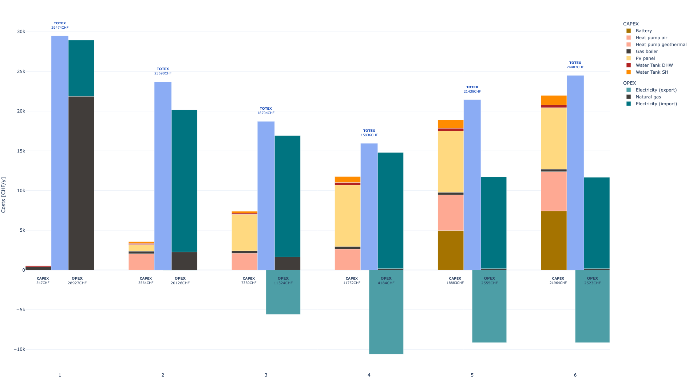
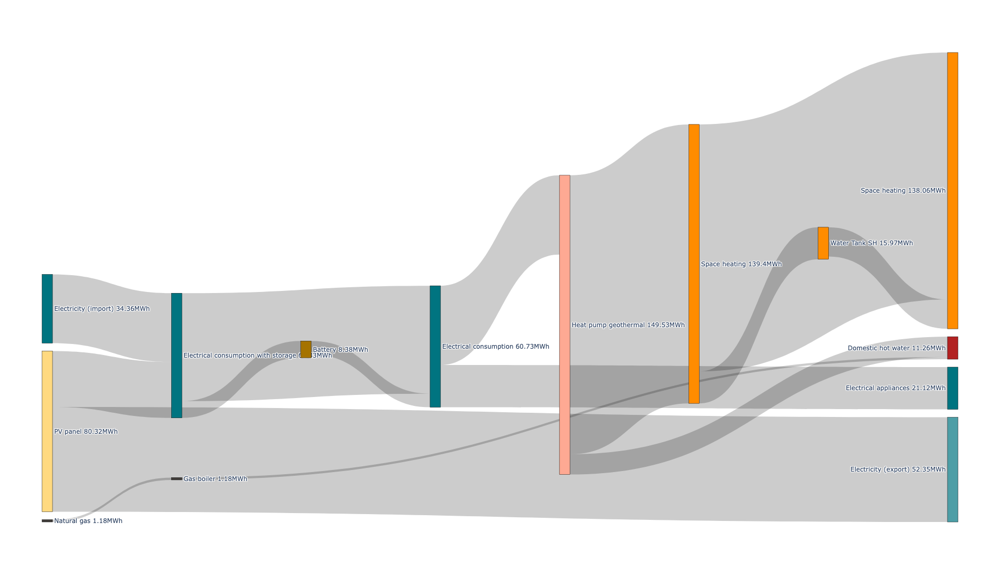

# Summary

The transition to sustainable energy systems in the face of growing renewable energy adoption and electrification is a complex and critical challenge. The Renewable Energy Hub Optimizer (REHO) emerges as a powerful decision support tool designed to investigate the deployment of energy conversion and storage technologies in this evolving landscape. REHO leverages a Mixed-Integer Linear Programming (MILP) framework combined with a Dantzig-Wolfe decomposition algorithm to simultaneously address the optimal design and operation of district energy systems, catering to multi-objective considerations across economic, environmental, and efficiency criteria.

REHO is deployed as an open-source and collaborative Python library, available as a [PyPI package](https://pypi.org/project/REHO/) and supported by comprehensive [documentation](https://reho.readthedocs.io/en/main/). Documentation website includes step-by-step instructions, details about the mathematical background and model foundations, as well as a list of academic publications, conference proceedings, research projects, and other works related to REHO.

This paper introduces REHO and highlights its key features and contributions to the field of sustainable energy system planning.

# Statement of need

Cities around the world are moving towards increasing the penetration of local energy harvesting and storage capacities to render their energy consumption more sustainable and less dependent on a geopolitical context. Intensification of renewables deployment is witnessed in the past decade and keeps continuing, leading to important techno-economic-social trade-offs in energy strategy. This transition blurs the boundaries between demand and supply and creates new types of stakeholders. Adopting a district-level approach for energy system planning seems thus particularly relevant, as it promotes the valorization of endogenous resources and enables economies of scale while preserving local governance [@heldewegRenewableEnergyCommunities2020]. The emergence of the concept of energy communities is a clear example of this growing interest for energy planning at the neighborhood scale [@dociExploringTransitionPotential2014]. Energy communities are expected to play a pivotal role in the ongoing energy transition by fostering decentralized, sustainable, and community-driven approaches to energy production and consumption. Through the collaborative efforts of residents, utilities, and institutions, energy communities offer a techno-economic framework to support the paradigm shift from centralized to distributed and district-level energy systems [@caramizaruEnergyCommunitiesOverview2020].

Optimizing a district-level energy system is a complex and computationally intensive task due to its network structure and interdependent decision variables. Facing this problem, a common method is to fix some degrees of freedom through assumptions and scenarios based on expert knowledge [@pickeringDistrictEnergySystem2019; @reynoldsOperationalSupplyDemand2019]. Many studies in literature assumes energy demand profiles [@murrayMultiObjectiveOptimisationPowertoMobility2020] or predetermines the energy system configuration [@kramerBottomupModelingResidential2017; @alhamwiModellingUrbanEnergy2018; @chakrabartiOptimisationAnalysisSystem2019]. The issue with such assumptions is the consideration of energy carriers to be delivered instead of energy end use demands to be satisfied. By assuming a priori some investment decisions into energy capacities, the solution space is reduced, and such model does not unveil the full potential of energy communities. However, modeling subsystems as entities embedded in a larger system should reveal the interdependency of the decision-making and exploit the main benefits of energy communities to coordinate decisions both at the building and district-level.

In the field of district energy systems design, diverse open-source decision support tools exist, but only partially meet the challenges that studying energy communities represent:

- `EnergyPlus` [@NRELEnergyPlus2024] (and any of its extensions such as `CESAR-P` [@orehounigCESARPDynamicUrban2022]) are simulation models, lacking an optimization feature
- `Calliope` [@pfenningerCalliopeMultiscaleEnergy2018] and `ModelicaBuildings` [@wetterModelicaBuildingsLibrary2014] do not support multi-objective optimization
- some tools focus on a specific energy carrier: electricity (`Clover` [@sandwellCLOVERModellingFramework2023], `Offgridders` [@RlinstitutOffgridders2024]), heating (`THERMOS` [@THERMOSThermalEnergy2021]), hydrogen (`RHEIA` [@coppittersRHEIARobustDesign2022]); while they are certainly relevant to specific areas of study, they do not adequately grasp the holistic nature of the problem
- `OSeMOSYS` [@howellsOSeMOSYSOpenSource2011], `EnergyPLAN` [@lundEnergyPLANAdvancedAnalysis2021] or `EnergyScope` [@limpensEnergyScopeTDNovel2019] focus on national energy systems and do not model buildings and their interactions with sufficient granularity (e.g., no heat cascade and distinction of temperature sets)
- eventually, `CityEnergyAnalyst` [@fonsecaArchitecturebuildingsystemsCityEnergyAnalystCityEnergyAnalyst2024] or `oemof-solph` [@krienOemofSolph2024] (and its extensions such as `SESMG` [@klemmSpreadsheetEnergySystem2023]) provide interesting frameworks for buildings energy systems optimization, but their district upscaling feature do not allow to explore the overarching implications of building-level decisions, so that their investigations predominantly hinge on a "almighty district-level perspective" without distinction of the different stakeholders.

This gap has motivated the development of Renewable Energy Hub Optimizer (REHO), a comprehensive decision support tool for energy system planning at the district-level, considering simultaneously diverse end use demands, multi-energy integration, and local actors interactions.

Initially developed to answer the needs of the IPESE research group, REHO is now made public, with a diverse target audience extending from academia and research projects, to decision-makers for municipalities, energy utilities and industrial partners.

# Model foundations

The energy hub concept [@mohammadiEnergyHubModel2017] is used to model an energy community where multi-energy carriers can supply diverse end use demands through building units and district units optimally interconnected and operated. The input data necessary to characterize a district-level energy hub to be optimized with REHO are:

- The geographic boundaries of the considered territory;
- The end use demands, resulting from the building stock and local weather;
- The technologies available and their specifications regarding cost, life cycle, efficiency;
- The endogenous resources;
- And the energy market prices for district imports and exports.

REHO exploits the benefits of two programming languages to explore the solution space of such district-level energy hub. \autoref{fig:diagram} illustrates the tool architecture:

- The data management structure is written in Python and used for input parameters preprocessing, and decision variables postprocessing.
- The optimization model is written in AMPL, encompassing objective functions, modelling equations, and constraints at building-level and district-level.

#### Data reduction
The task of optimally designing and scheduling energy systems with a high share of renewable energies is complex and computationally demanding. REHO includes machine learning techniques to cluster yearly input data. The model operates in the conventional way with typical periods $p$ of 24 timesteps $t$, but it can be freely adapted to a finer or coarser granularity as required.

#### MILP formulation with decomposition
A Dantzig-Wolfe decomposition is applied on the district-level problem to define a master problem (MP) and one sub-problem (SP) for each building. Linking constraints allow the problem to iteratively converge to the solution minimizing the global objective function: the MP sends optimal district-level prices to the SPs, which in turn send back optimal building-level design proposals.

# Embedded features

#### Multi-Service Consideration
REHO encompasses a wide range of end use demands, including thermal comfort (heating and cooling loads), domestic hot water, domestic electricity, mobility, and information and communication technologies needs.

#### Multi-Energy Integration
REHO incorporates various energy sources and networks, such as electricity, fossil fuels, biomass, biofuels, district heating and cooling networks, and hydrogen. This holistic approach ensures a comprehensive representation of the energy landscape.

#### Multi-Scale Capabilities
REHO's flexibility spans various scales, from individual buildings to entire districts. The district-scale optimization feature capitalizes on synergies between buildings, allowing them to function as an energy community and enabling energy and financial flows between buildings. In addition, such an approach opens the possibility of deploying district-level infrastructures.

#### Multi-Objective Optimization
REHO’s versatility extends to multi-objective optimization, accommodating objectives related to economic (capital and operational costs), environmental (life cycle analysis and global warming potential), and efficiency criteria. Epsilon constraints provide fine-grained control, enabling decision-makers to explore trade-offs and identify Pareto fronts.

#### PV orientation
Given the pivotal role of photovoltaic (PV) systems in the energy transition, their optimal deployment is of paramount importance and must consider the specific characteristics of the building morphology, the local solar irradiance, and the grid curtailment restrictions. REHO integrates the deployment of solar panels on roofs and facades, with the possibility to take into consideration the orientation of surfaces.

#### Electric mobility
REHO enables the integration of electric vehicles into neighborhoods, including the possibility of smart charging, unidirectional or bidirectional. The fleet of electric vehicles can thus be used to provide an energy storage service.

#### Grid constraints
As the electrification of diverse sectors gains momentum, the demands placed on the electricity grid are expected to further escalate. The existing electrical grid, originally designed for centralized power generation and unidirectional energy flows, now faces new demands and complexities. REHO allows for the consideration of the local grid specifications, through line and transformer capacities, or peak power shaving and curtailment measures.

#### District heating and cooling
REHO enables the deployment of district heating and cooling networks, with consideration of several heat transfer fluids and distribution temperatures. Infrastructure costs are also incorporated, based on the topology of the considered neighborhood.

#### Interoperability
The interoperability of REHO boasts its capability to interface and exchange information with other tools, enables extensive studies. By providing the relevant input data regarding energy needs and endogenous resources, investigations on energy communities can be carried out in a wide range of territories. As a demonstration, it was combined with the QBuildings GIS database [@loustauQBuildingsComprehensiveGuide2023], allowing for the optimization of Switzerland’s entire building stock comprising 2.6 million entities spread over 17'844 districts -- where is district is defined as the batch of buildings deserved by the same MV/LV transformer.

# Acknowledgements

Development of REHO was carried out within the Industrial Process and Energy Systems Engineering research group, EPFL. The authors acknowledge the support from the Services Industriels de Genève (SIG), Switzerland, and the support of the Swiss Federal Office of Energy (SFOE).
The authors also express their gratitude to Paul Stadler and Luise Middelhauve, whose PhD theses have laid the foundations for the model.

# References